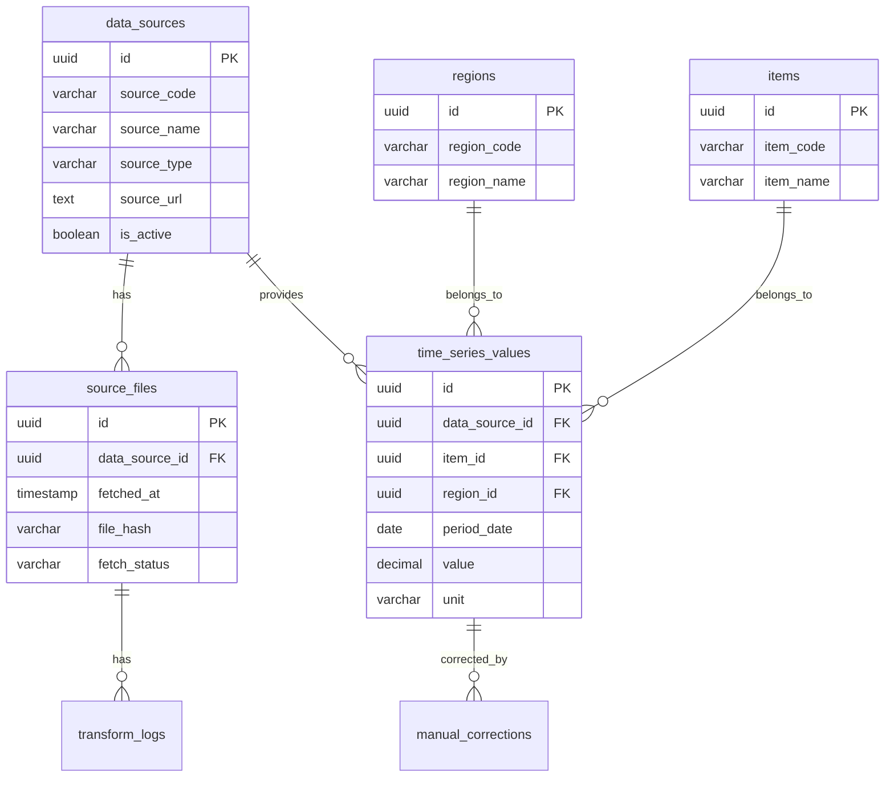

# Civil Cost Index Dashboard｜詳細設計仕様書

## 1. 文書概要

### 1.1 文書名

**Civil Cost Index Dashboard｜詳細設計仕様書**

### 1.2 対象システム

**Civil Cost Index Dashboard｜建設資材・労務単価トレンド可視化**

Git候補：`Civil-Cost-Index-Dashboard`

### 1.3 本書の目的

本書は、要件定義書で定義した業務要件・機能要件を実装可能な単位まで具体化し、画面、API、DB、バッチ、データ変換、ログ、テストの詳細仕様を定義する。

### 1.4 前提

- MVPではローカルまたは小規模社内利用を想定する。
- 公開データを主なデータソースとする。
- 初期版ではCSV・Excel手動取込を優先する。
- 自動取得、PDF解析、AIコメント生成、PowerPoint出力は段階的に拡張する。
- フロントエンド、バックエンド、データ処理を分離した構成とする。

---

## 2. システム構成設計

## 2.1 全体アーキテクチャ


## 2.2 レイヤー構成

| レイヤー | 役割 | 技術候補 |
| --- | --- | --- |
| フロントエンド | 画面表示、グラフ、操作UI | Next.js / React |
| UI | デザイン、コンポーネント | Tailwind CSS / shadcn-ui |
| グラフ | 時系列・比較グラフ | Apache ECharts / Recharts |
| バックエンドAPI | データ取得、集計、出力 | FastAPI / Next.js API Routes |
| データ処理 | CSV・Excel変換、正規化 | Python pandas |
| DB | マスタ、時系列、履歴保存 | PostgreSQL / SQLite |
| ファイル保存 | Rawファイル、出力ファイル保存 | ローカル / S3互換 |
| バッチ | データ取得・変換 | Python + cron / APScheduler |

## 2.3 推奨MVP構成

| 項目 | 採用案 |
| --- | --- |
| フロントエンド | Next.js |
| バックエンド | FastAPI |
| DB | SQLite、社内利用版ではPostgreSQL |
| データ処理 | Python pandas |
| グラフ | Apache ECharts |
| 起動方式 | Docker Compose |
| 認証 | MVPではなし、社内共有時にBasic認証またはSSO |

---

## 3. ディレクトリ構成

```
Civil-Cost-Index-Dashboard/
├── README.md
├── docker-compose.yml
├── .env.example
├── docs/
│   ├── requirements.md
│   ├── detailed-design.md
│   ├── api.md
│   ├── database.md
│   └── data-sources.md
├── apps/
│   ├── web/
│   │   ├── package.json
│   │   └── src/
│   │       ├── app/
│   │       ├── components/
│   │       ├── features/
│   │       ├── hooks/
│   │       ├── lib/
│   │       ├── types/
│   │       └── styles/
│   └── api/
│       ├── pyproject.toml
│       └── app/
│           ├── main.py
│           ├── core/
│           ├── routers/
│           ├── services/
│           ├── schemas/
│           ├── models/
│           ├── repositories/
│           └── batch/
├── data/
│   ├── raw/
│   ├── processed/
│   ├── exports/
│   └── samples/
├── scripts/
│   ├── fetch/
│   ├── transform/
│   └── seed/
└── tests/
    ├── unit/
    ├── integration/
    └── e2e/
```

---

## 4. 画面詳細設計

## 4.1 画面一覧

| 画面ID | パス | 画面名 |
| --- | --- | --- |
| SCR-001 | `/` | トップダッシュボード |
| SCR-002 | `/timeseries` | 時系列分析 |
| SCR-003 | `/compare` | 比較分析 |
| SCR-004 | `/table` | データテーブル |
| SCR-005 | `/export` | レポート出力 |
| SCR-006 | `/admin/data-sources` | データソース管理 |
| SCR-007 | `/admin/fetch-jobs` | データ取込履歴 |
| SCR-008 | `/admin/masters` | マスタ管理 |
| SCR-009 | `/settings` | ユーザー設定 |

## 4.2 共通レイアウト

### 構成

- Header
    - システム名
    - 最終更新日時
    - 現在の対象地域
    - 出力ボタン
- Sidebar
    - トップ
    - 時系列分析
    - 比較分析
    - データテーブル
    - レポート出力
    - 管理
- MainContent
    - 各画面コンテンツ
- Footer
    - データ出典
    - 注意書き
    - バージョン

## 4.3 SCR-001：トップダッシュボード

### 目的

主要指標、注目変動、データ更新状況を素早く把握する。

### コンポーネント

| コンポーネント | 内容 |
| --- | --- |
| SummaryCardGrid | KPIカード一覧 |
| MainTrendChart | 主要指標トレンド |
| AlertList | 注目変動一覧 |
| UpdateStatusPanel | データ更新状況 |
| RegionFilter | 地域フィルター |
| PeriodFilter | 期間フィルター |

### 表示データ

- 主要資材価格指数
- 労務単価指数
- 建設関連物価指数
- 前月比・前年比
- 注目変動
- 最終更新日時

### API

- `GET /api/dashboard/summary`
- `GET /api/alerts`

## 4.4 SCR-002：時系列分析

### 目的

選択したデータ系列の時系列推移をグラフ・表で確認する。

### 入力項目

| 項目 | 型 | 必須 | 説明 |
| --- | --- | --- | --- |
| data_type | select | 必須 | MATERIAL_PRICE等 |
| item_ids | multi-select | 任意 | 品目・職種・指数 |
| region_ids | multi-select | 任意 | 地域 |
| start_period | month | 任意 | 開始年月 |
| end_period | month | 任意 | 終了年月 |
| normalize | boolean | 任意 | 指数化するか |
| base_period | month | 任意 | 基準年月 |
| chart_type | select | 任意 | line / bar / mixed |

### コンポーネント

- FilterPanel
- TrendChart
- DataTable
- SourceNote
- ExportButtons

### API

- `GET /api/timeseries`
- `GET /api/items`
- `GET /api/regions`
- `GET /api/export/csv`

## 4.5 SCR-003：比較分析

### 目的

複数系列を条件指定して比較する。

### 主な仕様

- 系列を最大10件まで追加可能。
- 実数比較は同一単位のみ許可。
- 異単位比較では指数化表示を必須とする。
- 基準年月が未指定の場合、表示期間の最初の値を基準とする。

### API

- `GET /api/compare`

## 4.6 SCR-004：データテーブル

### 目的

条件に合致する時系列データを表形式で確認する。

### 機能

- フィルター
- ソート
- ページング
- CSV出力
- 出典リンク表示
- 欠損・速報・改定ステータス表示

### API

- `GET /api/timeseries`
- `GET /api/export/csv`

---

## 5. フロントエンド詳細設計

## 5.1 コンポーネント設計

| コンポーネント | 役割 |
| --- | --- |
| AppShell | 共通レイアウト |
| Header | システム名、更新日時、メニュー |
| Sidebar | 画面遷移 |
| FilterPanel | 条件指定 |
| SummaryCard | KPI表示 |
| TrendChart | 時系列グラフ |
| CompareChart | 比較グラフ |
| DataTable | 表形式表示 |
| AlertList | 注目変動表示 |
| SourceBadge | 出典表示 |
| ExportPanel | 出力条件 |
| LoadingState | 読込中表示 |
| EmptyState | データなし表示 |
| ErrorMessage | エラー表示 |

## 5.2 状態管理

### URLクエリで保持する条件

- `data_type`
- `item_ids`
- `region_ids`
- `start_period`
- `end_period`
- `normalize`
- `base_period`
- `chart_type`

### ローカルストレージで保持する条件

- 初期表示地域
- よく見る品目
- 表示期間
- テーマ
- 最後に利用したフィルター

## 5.3 グラフ表示ルール

- 実数表示では、単位が異なる系列を同一軸に表示しない。
- 指数表示では、基準年月を100として表示する。
- 欠損値は線を途切れさせる。
- 速報値は点線または注記で表現する。
- 改定値がある場合はツールチップで表示する。
- グラフ下部に出典・データ基準日を表示する。

## 5.4 色・表示ルール

| 状態 | 表示 |
| --- | --- |
| 上昇 | 赤系、上向きアイコン |
| 下落 | 青系、下向きアイコン |
| 横ばい | グレー |
| 警告 | オレンジ |
| エラー | 赤 |
| 未取得 | グレー |

---

## 6. API詳細設計

## 6.1 API一覧

| API ID | メソッド | パス | 概要 |
| --- | --- | --- | --- |
| API-001 | GET | `/api/dashboard/summary` | トップサマリー取得 |
| API-002 | GET | `/api/timeseries` | 時系列データ取得 |
| API-003 | GET | `/api/compare` | 比較データ取得 |
| API-004 | GET | `/api/items` | 品目マスタ取得 |
| API-005 | GET | `/api/regions` | 地域マスタ取得 |
| API-006 | GET | `/api/data-sources` | データソース一覧取得 |
| API-007 | POST | `/api/data-sources` | データソース登録 |
| API-008 | PATCH | `/api/data-sources/{id}` | データソース更新 |
| API-009 | POST | `/api/fetch-jobs` | データ取得ジョブ実行 |
| API-010 | GET | `/api/fetch-jobs` | データ取得履歴取得 |
| API-011 | POST | `/api/uploads` | 手動ファイルアップロード |
| API-012 | GET | `/api/export/csv` | CSV出力 |
| API-013 | POST | `/api/export/report` | レポート生成 |
| API-014 | GET | `/api/alerts` | 注目変動取得 |

## 6.2 共通レスポンス形式

### 成功時

```json
{
  "success": true,
  "data": {},
  "meta": {
    "request_id": "string",
    "generated_at": "2026-07-31T21:00:00+09:00"
  }
}
```

### エラー時

```json
{
  "success": false,
  "error": {
    "code": "VALIDATION_ERROR",
    "message": "入力値が不正です。",
    "details": []
  },
  "meta": {
    "request_id": "string"
  }
}
```

## 6.3 API-001：トップサマリー取得

**GET** `/api/dashboard/summary`

### クエリ

| パラメータ | 型 | 必須 | 説明 |
| --- | --- | --- | --- |
| region_id | UUID | 任意 | 地域ID |
| period | string | 任意 | latest / 1y / 3y / 5y |
| base_period | string | 任意 | 指数化基準年月 |

### レスポンス例

```json
{
  "success": true,
  "data": {
    "latest_period": "2026-06",
    "last_updated_at": "2026-07-31T10:00:00+09:00",
    "kpis": [
      {
        "name": "鋼材価格",
        "value": 128.4,
        "unit": "index",
        "mom_rate": 1.2,
        "yoy_rate": 8.5
      }
    ],
    "alerts": [
      {
        "item_name": "アスファルト",
        "region_name": "全国",
        "period": "2026-06",
        "yoy_rate": 12.3,
        "reason": "前年比10%以上"
      }
    ]
  }
}
```

## 6.4 API-002：時系列データ取得

**GET** `/api/timeseries`

### クエリ

| パラメータ | 型 | 必須 | 説明 |
| --- | --- | --- | --- |
| data_type | string | 必須 | MATERIAL_PRICE等 |
| item_ids | string | 任意 | カンマ区切り |
| region_ids | string | 任意 | カンマ区切り |
| start_period | string | 任意 | YYYY-MM |
| end_period | string | 任意 | YYYY-MM |
| normalize | boolean | 任意 | 指数化するか |
| base_period | string | 任意 | 基準年月 |

### レスポンス例

```json
{
  "success": true,
  "data": {
    "conditions": {
      "data_type": "MATERIAL_PRICE",
      "start_period": "2021-04",
      "end_period": "2026-06",
      "normalize": true,
      "base_period": "2021-04"
    },
    "series": [
      {
        "series_id": "steel-national",
        "label": "鋼材｜全国",
        "unit": "index",
        "source_name": "公開統計",
        "points": [
          {
            "period": "2021-04",
            "value": 100.0,
            "raw_value": 85000,
            "mom_rate": null,
            "yoy_rate": null
          }
        ]
      }
    ]
  }
}
```

---

## 7. DB詳細設計

## 7.1 ER図



## 7.2 テーブル：regions

| カラム | 型 | 必須 | 説明 |
| --- | --- | --- | --- |
| id | UUID | 必須 | 地域ID |
| region_code | VARCHAR(50) | 必須 | 地域コード |
| region_name | VARCHAR(100) | 必須 | 地域名 |
| region_type | VARCHAR(30) | 必須 | national / area / prefecture / city |
| parent_region_id | UUID | 任意 | 親地域ID |
| display_order | INTEGER | 任意 | 表示順 |
| is_active | BOOLEAN | 必須 | 有効フラグ |
| created_at | TIMESTAMP | 必須 | 作成日時 |
| updated_at | TIMESTAMP | 必須 | 更新日時 |

## 7.3 テーブル：items

| カラム | 型 | 必須 | 説明 |
| --- | --- | --- | --- |
| id | UUID | 必須 | 品目ID |
| item_code | VARCHAR(100) | 必須 | 品目コード |
| item_name | VARCHAR(200) | 必須 | 品目名 |
| category | VARCHAR(50) | 必須 | MATERIAL_PRICE / LABOR_COST / PRICE_INDEX等 |
| sub_category | VARCHAR(100) | 任意 | サブ分類 |
| standard_name | VARCHAR(200) | 任意 | 規格名 |
| default_unit | VARCHAR(50) | 任意 | 標準単位 |
| display_order | INTEGER | 任意 | 表示順 |
| is_active | BOOLEAN | 必須 | 有効フラグ |
| created_at | TIMESTAMP | 必須 | 作成日時 |
| updated_at | TIMESTAMP | 必須 | 更新日時 |

## 7.4 テーブル：data_sources

| カラム | 型 | 必須 | 説明 |
| --- | --- | --- | --- |
| id | UUID | 必須 | データソースID |
| source_code | VARCHAR(100) | 必須 | データソースコード |
| source_name | VARCHAR(200) | 必須 | データソース名 |
| source_type | VARCHAR(50) | 必須 | material / labor / index / fuel / other |
| provider_name | VARCHAR(200) | 必須 | 提供元 |
| source_url | TEXT | 任意 | 取得元URL |
| file_format | VARCHAR(20) | 任意 | csv / xlsx / pdf / html / api |
| update_frequency | VARCHAR(30) | 任意 | monthly / yearly / irregular |
| license_note | TEXT | 任意 | 利用規約・注意事項 |
| is_active | BOOLEAN | 必須 | 有効フラグ |
| last_fetched_at | TIMESTAMP | 任意 | 最終取得日時 |
| created_at | TIMESTAMP | 必須 | 作成日時 |
| updated_at | TIMESTAMP | 必須 | 更新日時 |

## 7.5 テーブル：time_series_values

| カラム | 型 | 必須 | 説明 |
| --- | --- | --- | --- |
| id | UUID | 必須 | レコードID |
| data_source_id | UUID | 必須 | データソースID |
| data_type | VARCHAR(50) | 必須 | MATERIAL_PRICE / LABOR_COST / PRICE_INDEX等 |
| item_id | UUID | 任意 | 品目ID |
| region_id | UUID | 任意 | 地域ID |
| period_type | VARCHAR(20) | 必須 | monthly / yearly |
| period_date | DATE | 必須 | 対象年月日。月次は月初日 |
| value | DECIMAL(18,4) | 必須 | 値 |
| unit | VARCHAR(50) | 任意 | 単位 |
| base_period | VARCHAR(20) | 任意 | 指数の基準時点 |
| original_item_name | VARCHAR(200) | 任意 | 取得元の品目名 |
| original_region_name | VARCHAR(200) | 任意 | 取得元の地域名 |
| source_file_id | UUID | 任意 | 取得ファイルID |
| value_status | VARCHAR(30) | 任意 | confirmed / preliminary / revised / missing |
| note | TEXT | 任意 | 注記 |
| created_at | TIMESTAMP | 必須 | 作成日時 |
| updated_at | TIMESTAMP | 必須 | 更新日時 |

## 7.6 テーブル：source_files

| カラム | 型 | 必須 | 説明 |
| --- | --- | --- | --- |
| id | UUID | 必須 | ファイルID |
| data_source_id | UUID | 必須 | データソースID |
| fetched_at | TIMESTAMP | 必須 | 取得日時 |
| original_url | TEXT | 任意 | 取得元URL |
| file_name | VARCHAR(255) | 任意 | ファイル名 |
| file_format | VARCHAR(20) | 任意 | ファイル形式 |
| file_hash | VARCHAR(128) | 任意 | ハッシュ値 |
| storage_path | TEXT | 任意 | 保存パス |
| fetch_status | VARCHAR(20) | 必須 | success / failed |
| error_message | TEXT | 任意 | エラー内容 |
| created_at | TIMESTAMP | 必須 | 作成日時 |

## 7.7 テーブル：transform_logs

| カラム | 型 | 必須 | 説明 |
| --- | --- | --- | --- |
| id | UUID | 必須 | ログID |
| source_file_id | UUID | 必須 | ファイルID |
| transform_status | VARCHAR(30) | 必須 | success / partial_success / failed |
| total_rows | INTEGER | 任意 | 総行数 |
| success_rows | INTEGER | 任意 | 成功行数 |
| error_rows | INTEGER | 任意 | エラー行数 |
| error_detail | JSON | 任意 | エラー詳細 |
| started_at | TIMESTAMP | 必須 | 開始日時 |
| finished_at | TIMESTAMP | 任意 | 終了日時 |

## 7.8 インデックス

| テーブル | インデックス | 目的 |
| --- | --- | --- |
| time_series_values | data_type, item_id, region_id, period_date | 時系列検索 |
| time_series_values | period_date | 期間検索 |
| time_series_values | data_source_id | 出典別検索 |
| source_files | data_source_id, fetched_at | 取得履歴検索 |
| source_files | file_hash | 重複判定 |
| items | item_code | 品目検索 |
| regions | region_code | 地域検索 |

## 7.9 一意制約

### time_series_values

```
data_source_id + data_type + item_id + region_id + period_date + unit
```

### source_files

```
data_source_id + file_hash
```

---

## 8. バッチ・データ取込詳細設計

## 8.1 処理フロー

1. 有効なデータソースを抽出する。
2. 取得URLまたはアップロードファイルから元ファイルを取得する。
3. ファイル形式、サイズ、ハッシュ値を確認する。
4. 同一ハッシュのファイルが既に存在する場合は重複登録を避ける。
5. 元ファイルを`data/raw`に保存する。
6. データソース別の変換処理を実行する。
7. 共通フォーマットへ変換する。
8. 地域マスタ・品目マスタと照合する。
9. `time_series_values`へUPSERTする。
10. 取得ログ・変換ログを保存する。
11. エラーがあれば管理画面に表示する。

## 8.2 ジョブ種別

| ジョブ種別 | 内容 |
| --- | --- |
| scheduled_fetch | 定期取得 |
| manual_fetch | 管理者による手動取得 |
| manual_upload | 手動ファイルアップロード |
| re_transform | 既存ファイルの再変換 |
| correction_import | 補正データ取込 |

## 8.3 共通変換ルール

| 項目 | 変換ルール |
| --- | --- |
| 年月 | YYYY-MM形式へ変換し、DBでは月初日DATEで保存 |
| 和暦 | 西暦へ変換 |
| 数値 | カンマ、全角数字、注記記号を除去してDECIMAL化 |
| 地域 | 地域マスタへ正規化 |
| 品目 | 品目マスタへ正規化 |
| 単位 | 標準単位へ統一 |
| 欠損値 | NULL、またはvalue_status=missing |
| 速報値 | value_status=preliminary |
| 改定値 | value_status=revised |
| 出典 | data_source_id、source_file_idを付与 |

## 8.4 エラー処理

| エラー | 処理 |
| --- | --- |
| ファイル取得失敗 | source_files.fetch_status=failed |
| ファイル形式不正 | transform_status=failed |
| 必須列不足 | transform_status=failed |
| 数値変換失敗 | 該当行をerror_detailへ記録 |
| マスタ未登録 | 未マッピング一覧として記録 |
| 重複データ | UPSERTまたはスキップ |
| 出典不明 | 警告または登録不可 |

---

## 9. ビジネスロジック詳細設計

## 9.1 指数化ロジック

### 入力

- 対象系列
- 基準年月
- 表示期間

### 処理

1. 系列ごとに基準年月の値を取得する。
2. 基準年月の値がない場合、最も近い過去値を使用するか、指数化不可とする。
3. 基準値が0またはNULLの場合は指数化不可とする。
4. 各時点の値を以下で算出する。

```
指数値 = 対象年月の値 ÷ 基準年月の値 × 100
```

1. 小数第1位または第2位に丸める。

## 9.2 前月比・前年比

```
前月比 = 今月値 ÷ 前月値 × 100 - 100
前年比 = 今月値 ÷ 前年同月値 × 100 - 100
```

### 注意点

- 前月値・前年同月値がない場合はNULL。
- 分母が0の場合はNULL。
- 表示時は`+1.2%`、`-0.8%`の形式とする。

## 9.3 注目変動検出

### 初期条件

```
abs(前月比) >= 5%
または
abs(前年比) >= 10%
または
3か月連続上昇
または
3か月連続下落
```

### 優先度

| 条件 | 優先度 |
| --- | --- |
| 前年比±20%以上 | 高 |
| 前年比±10%以上 | 中 |
| 前月比±5%以上 | 中 |
| 連続上昇・下落 | 低 |

---

## 10. サービス設計

## 10.1 サービス一覧

| サービス | 役割 |
| --- | --- |
| DashboardService | KPI・注目変動の集計 |
| TimeSeriesService | 時系列データ取得・指数化 |
| CompareService | 複数系列比較 |
| ExportService | CSV/PDF/画像出力 |
| DataSourceService | データソース管理 |
| FetchService | ファイル取得 |
| TransformService | データ変換 |
| MasterService | 地域・品目マスタ管理 |
| AlertService | 変動検出 |

## 10.2 TimeSeriesService

### 主な処理

- 条件に基づく時系列データ取得
- 前月比・前年比計算
- 指数化
- 欠損値処理
- 出典情報付与

### 入力

- data_type
- item_ids
- region_ids
- start_period
- end_period
- normalize
- base_period

### 出力

- series
- points
- source
- unit
- status

## 10.3 ExportService

### CSV出力

- フィルター条件を反映する。
- UTF-8 BOM付きCSVを検討する。
- カラム名は日本語表示名とする。

### PNG出力

- 表示中グラフを画像化する。
- タイトル、条件、出典、作成日を含める。

### PDF出力

- グラフ、表、サマリー、出典、注記を含める。
- A4横またはA4縦を選択できるようにする。

---

## 11. ログ設計

## 11.1 ログ種別

| ログ種別 | 内容 |
| --- | --- |
| access | APIアクセス |
| app | アプリケーション処理 |
| fetch | データ取得 |
| transform | データ変換 |
| export | レポート出力 |
| error | 例外・エラー |

## 11.2 ログ項目

- timestamp
- level
- request_id
- user_id
- module
- action
- status
- message
- duration_ms
- error_detail

## 11.3 ログレベル

| レベル | 用途 |
| --- | --- |
| DEBUG | 開発時の詳細確認 |
| INFO | 通常処理 |
| WARN | 継続可能な警告 |
| ERROR | 処理失敗 |
| CRITICAL | システム継続困難 |

---

## 12. テスト詳細設計

## 12.1 単体テスト

| 対象 | テスト内容 |
| --- | --- |
| 指数化ロジック | 基準値100、NULL、0除算 |
| 前月比・前年比 | 正常値、欠損値、0除算 |
| データ変換 | 日付、数値、単位、地域名 |
| アラート判定 | 閾値判定、連続上昇 |
| APIパラメータ | 必須、型、範囲 |

## 12.2 結合テスト

- データ取得からDB登録まで
- DB登録からダッシュボード表示まで
- フィルター条件変更とグラフ再描画
- CSV出力
- PDF出力
- データ取得失敗時の管理画面表示

## 12.3 E2Eテスト

### シナリオ例

1. 利用者がトップ画面を開く。
2. 地域を「全国」に設定する。
3. 資材価格「鋼材」を選択する。
4. 期間を過去5年に設定する。
5. グラフを確認する。
6. CSVを出力する。
7. PDFレポートを出力する。

---

## 13. 開発タスク詳細

## 13.1 初期セットアップ

- [ ]  Gitリポジトリ作成：`Civil-Cost-Index-Dashboard`
- [ ]  README作成
- [ ]  Docker構成作成
- [ ]  フロントエンド雛形作成
- [ ]  バックエンド雛形作成
- [ ]  DBマイグレーション作成
- [ ]  サンプルデータ配置

## 13.2 データ基盤

- [ ]  地域マスタ作成
- [ ]  品目マスタ作成
- [ ]  データソースマスタ作成
- [ ]  時系列値テーブル作成
- [ ]  取得ファイルテーブル作成
- [ ]  変換ログテーブル作成
- [ ]  サンプルデータ投入

## 13.3 取込機能

- [ ]  CSV読込処理
- [ ]  Excel読込処理
- [ ]  データ正規化処理
- [ ]  マスタ照合処理
- [ ]  UPSERT処理
- [ ]  エラー行記録
- [ ]  取込履歴表示

## 13.4 API

- [ ]  トップサマリーAPI
- [ ]  時系列API
- [ ]  比較API
- [ ]  品目API
- [ ]  地域API
- [ ]  データソースAPI
- [ ]  CSV出力API
- [ ]  アラートAPI

## 13.5 フロントエンド

- [ ]  共通レイアウト
- [ ]  フィルターパネル
- [ ]  KPIカード
- [ ]  時系列グラフ
- [ ]  比較グラフ
- [ ]  データテーブル
- [ ]  CSV出力ボタン
- [ ]  データソース管理画面
- [ ]  取込履歴画面

---

## 14. README記載案

```markdown
# Civil Cost Index Dashboard

建設資材価格、労務単価、物価指数を可視化するダッシュボードです。

## Features

- 建設資材価格の時系列可視化
- 公共工事設計労務単価の推移確認
- 建設関連物価指数の比較
- 基準年月100の指数化比較
- CSV / PDF出力
- データ取得・変換履歴管理

## Tech Stack

- Next.js
- React
- Tailwind CSS
- FastAPI
- PostgreSQL / SQLite
- Python pandas
- Apache ECharts

## Getting Started

```

git clone https://github.com/your-name/Civil-Cost-Index-Dashboard.git

cd Civil-Cost-Index-Dashboard

docker compose up -d

```

```

---

## 15. 今後の拡張設計

## 15.1 概算工事費シミュレーション

- 工種別の標準構成比を設定する。
- 資材費、労務費、機械経費の指数を組み合わせる。
- 過去単価から現在価格への補正係数を算出する。

## 15.2 AI市況コメント生成

- 前月比・前年比・長期トレンドをもとにコメントを生成する。
- 説明資料用の文章を自動作成する。
- 変動要因候補を外部ニュースと組み合わせて提示する。

## 15.3 PowerPoint出力

- グラフとサマリーを1枚資料として出力する。
- 複数品目の比較レポートを自動生成する。
- 社内会議資料テンプレートに合わせて出力する。

## 15.4 Notion連携

- ダッシュボード概要をNotionページへ自動出力する。
- 月次市況レポートをNotionデータベースへ保存する。
- プロジェクト別の概算検討メモと紐づける。