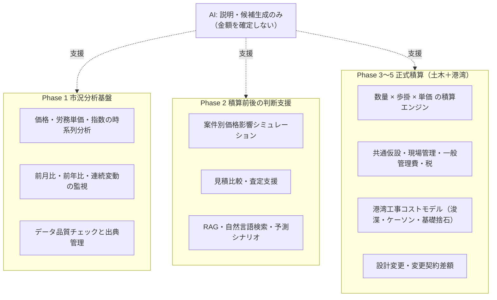
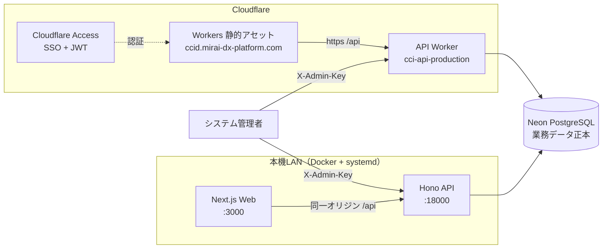
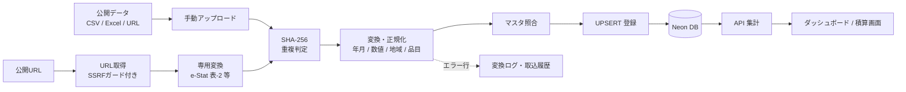
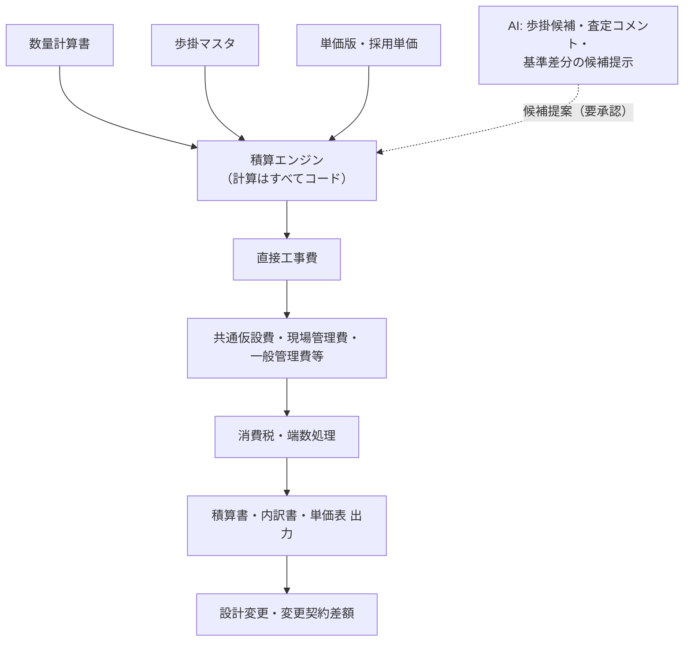
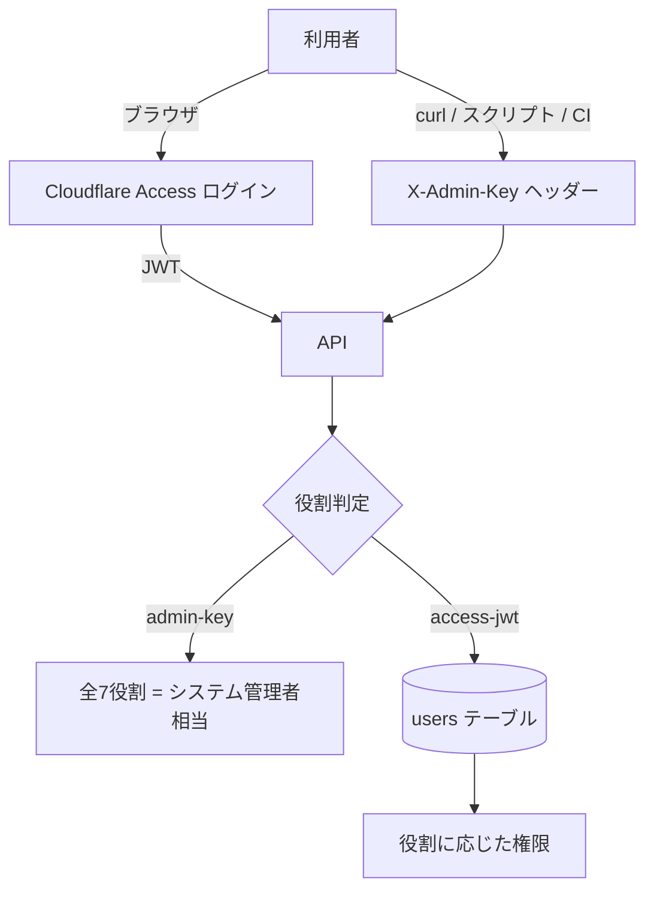
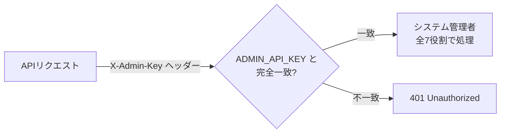
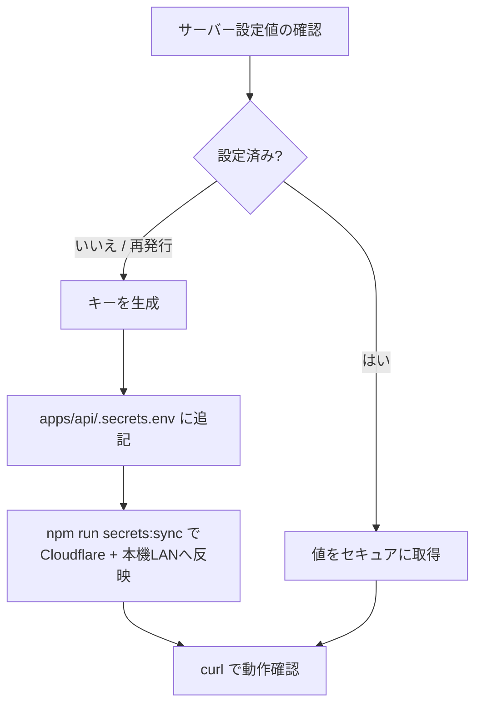
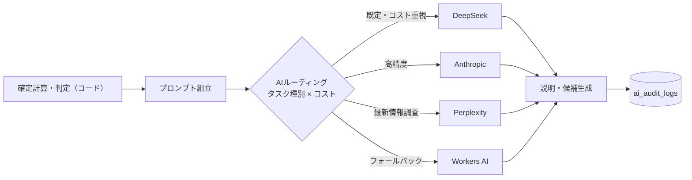
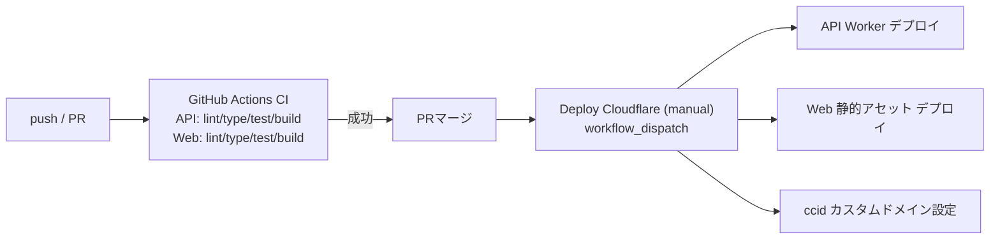

# 🏗️ Civil Cost Index Dashboard（CCI）

> 建設コスト・市況分析基盤 ＋ 土木建設専用積算システム（AI積極活用）


## 📋 概要

公開されている建設資材価格・労務単価・物価指数を収集・整形・蓄積し、
**時系列グラフ・比較分析・レポート出力**に加えて、**案件別の価格影響分析**や
**数量×歩掛×単価による積算計算（直接工事費・諸経費・税まで）**を提供するシステムです。

積算担当・営業・工事部門・経営層が、以下の業務で利用します。

- 入札参加前の市況確認と価格変動の共通認識
- 過年度案件を基準にした概算補正の根拠整理
- 見積有効期間中の価格変動確認と案件別リスク試算
- 工事数量からの積算計算（一般土木・港湾工事）
- 発注者への価格上昇説明・経営会議用資料の作成

### システムの位置付け

本システムは、市況分析（Phase 1）から案件影響分析（Phase 2）、正式積算（Phase 3〜5）までを
一体で提供します。**計算と判定は必ずコード**が行い、**AIは説明と候補生成のみ**を担当します。



> **注意**: 表示データは参考情報です。積算・契約・経営判断の最終根拠は出典元の公表データと
> 専門家の確認をもとにしてください（末尾の免責も参照）。

## ✨ 主な機能

| 機能 | 説明 | 画面 |
| --- | --- | --- |
| 📊 トップダッシュボード | KPI・注目変動・データ更新状況・AI市況サマリー | `/` |
| 📈 時系列分析 | 品目・地域・期間指定のトレンド | `/timeseries/` |
| 🔄 比較分析 | 複数系列の比較・基準年月100指数化 | `/compare/` |
| 📋 データテーブル | ソート・ページング・状態表示 | `/table/` |
| 📤 レポート出力 | CSV／Excel／PDF／PowerPoint＋積算連携Excel | `/export/` |
| ▥ 案件影響分析 | 案件・数量・基準単価・調達月から価格影響額をシナリオ/月別に試算 | `/projects/` |
| ⚓ 港湾コストモデル | 作業船損料・稼働率・回航費・待機費・海象条件（浚渫／ケーソン／基礎捨石） | `/port/` |
| ≖ 積算計算 | 数量×歩掛×単価→諸経費→税の積算エンジン（端数処理・積算書Excel・AI歩掛候補） | `/estimates/` |
| ▤ 積算基準・諸経費 | 基準年度・適用日・端数規則・諸経費率（3経路のデータ取込対応） | `/admin/estimation-bases/` |
| ⌬ 工種・歩掛マスタ | 工種体系・歩掛（労務/材料/機械）・CSV/Excel一括取込 | `/admin/breakdowns/` |
| № 数量計算書 | 案件別の数量・施工条件の入力とAI候補抽出 | `/admin/quantities/` |
| ⇄ 設計変更・差額 | 変更前後数量・単価・基準年度の保持と増減額明細 | `/admin/change-orders/` |
| 〒 見積比較・査定 | 協力会社見積の取込・正規化・異常値警告・採用理由記録 | `/admin/quotations/` |
| 🏗 施工実績 | 社内実績単価の蓄積と採用単価候補へのフィードバック | `/admin/construction-records/` |
| 🗂️ データソース管理 | 公式データソース登録・URL取得（CSV/Excel）・無効化 | `/admin/data-sources/` |
| 📥 取込履歴 | CSV/Excel/URL取込の成功・失敗・エラー行確認 | `/admin/fetch-jobs/` |
| ⏰ 定期取得 | Cloudflare Cronによる日次/月次/年次取得・未更新通知・承認後に本番反映 | `/admin/schedules/` |
| ✓ 承認待ちデータ | 定期取得データの承認・却下 | `/admin/staged/` |
| ¥ 単価版管理 | 適用開始日・税込/税抜・旧版比較・承認・スナップショット | `/admin/price-versions/` |
| ☺ ユーザー管理 | RBAC（7役割）とCloudflare Accessメール連携 | `/admin/users/` |
| ✎ 操作監査 | 個人単位の操作監査ログ | `/admin/audit/` |
| ◈ AI管理 | データ品質チェック・AI利用監査ログ・DeepSeek APIキー設定 | `/admin/ai/` |
| ✦ AI市況ナビ | AI市況サマリー・アラート説明・レポート生成・分析テンプレート | `/ai/` |
| 📊 経営ダッシュボード | 案件別粗利・港湾稼働率・採用単価の実績対比 | `/admin/management/` |

## 🗂️ データ種別（実単価／指数／動向評価値の区別）

システムではデータを以下の種別で管理し、画面上で「積算参考可／参考のみ」を区別します。

| データ種別 | 例 | 積算利用 |
| --- | --- | --- |
| 実単価 | けんせつPlaza 主要建設資材価格、公共工事設計労務単価 | 単価候補として利用可能 |
| 公的指数 | e-Stat 消費者物価指数、建設物価指数 | 価格補正・傾向分析 |
| 動向評価値 | 主要建設資材需給・価格動向調査（1〜5段階） | 市況の参考情報のみ |
| 社内実績単価 | 購買価格、協力会社見積 | 権限管理下で積算参考 |
| 採用単価 | 積算責任者が決定した単価 | 正式な積算計算に使用 |

`ESTAT_MATERIAL_SUPPLY`（主要建設資材需給・価格動向調査）は**国土交通省**が毎月公表する
モニター調査の**動向評価値**であり、円/t・円/m³ の実価格でも公的指数でもありません。
本システムでは「参考のみ」として取扱い、実単価系列と同じグラフで比較する場合も種別バッジを表示します。

## 🌐 稼働 URL

### 🖥️ 本機（LAN）運用

| 対象 | URL | 備考 |
| --- | --- | --- |
| Web UI | <http://192.168.0.185:3000> | Next.js（Docker + systemd） |
| API（直接） | <http://192.168.0.185:18000> | Hono API |
| API（Web経由） | `http://192.168.0.185:3000/api/*` | 同一オリジンプロキシ（CORS不要） |

systemd ユニット `cci.service` が起動時自動起動し、Docker Compose で api/web を常駐させています。

### ☁️ Cloudflare（本番ドメイン）

| 対象 | URL | 備考 |
| --- | --- | --- |
| Web（本番ドメイン） | <https://ccid.mirai-dx-platform.com> | Cloudflare Access 適用済み（mirai-const.co.jp メール限定） |
| API（バックエンド） | <https://cci-api-production.kensan1969.workers.dev> | Cloudflare Worker（Hono + Neon） |
| API ヘルスチェック | <https://cci-api-production.kensan1969.workers.dev/api/health/ready> | DB接続含む死活確認 |
| DB（正本） | Neon PostgreSQL（ap-southeast-1） | 接続情報は Cloudflare Secret で管理 |

未認証アクセスは Cloudflare Access のログインへリダイレクトされます。
API Worker 直URL・LAN API への未認証アクセスは **401** を返します（`ALLOW_ANONYMOUS_VIEWER=false` が既定）。
デモ・評価目的でのみ環境変数 `ALLOW_ANONYMOUS_VIEWER=true` で未認証閲覧者を許可できます。

## 🏛️ アーキテクチャ

### 全体構成図



### データフロー



### 積算フロー



## 🔑 認証・権限（RBAC と X-Admin-Key）

### 認証の全体像

API の認証には次の経路があります。

| 認証経路 | 誰 | 権限 | 記録 |
| --- | --- | --- | --- |
| Cloudflare Access JWT | ブラウザでログインした社員 | `users` テーブルに設定された役割 | メールアドレス |
| `X-Admin-Key` | キーを知る人（原則システム管理者） | **全7役割（システム管理者相当）** | `admin-key` |
| 信頼ヘッダー | リバースプロキシ設定時（LAN） | ヘッダーで指定された役割 | メールアドレス |
| Basic認証 | LAN全体ゲート（`BASIC_AUTH_USERNAME/PASSWORD` 設定時） | 閲覧者（viewer）相当 | `basic-auth` |
| 未認証 | 誰でも | **401（認証必須）**。デモ環境のみ `ALLOW_ANONYMOUS_VIEWER=true` で閲覧者 | `anonymous` |



### 7つの役割（RBAC）

| 役割 | 主な操作 |
| --- | --- |
| 閲覧者（viewer） | ダッシュボード・時系列・積算結果の閲覧 |
| データ取込担当（data_ingester） | CSV/Excel/URL取込・データソース登録 |
| データ承認者（data_approver） | 承認待ちデータ・単価版の承認 |
| 積算担当（estimator） | 案件・数量・積算・見積比較の入力 |
| 積算責任者（estimating_manager） | 採用単価の決定・積算書の承認 |
| 監査者（auditor） | 操作監査ログ・AI利用監査ログの閲覧 |
| システム管理者（system_admin） | ユーザー管理・全操作 |

### X-Admin-Key とは

`X-Admin-Key` は、API リクエストの HTTP ヘッダーに指定する**共有シークレット**です。
値がサーバー側の環境変数 `ADMIN_API_KEY` と一致した場合、そのリクエストは
**システム管理者（全7役割）**として扱われます。

```text
リクエスト例

GET /api/users
X-Admin-Key: <ADMIN_API_KEY の値>
```

仕組み:

1. サーバーはリクエストの `X-Admin-Key` ヘッダーを読み取る
2. サーバー設定値 `ADMIN_API_KEY` と**完全一致**するか比較する
3. 一致 → すべての役割を持つ管理者として処理
4. 不一致 → 401 Unauthorized（管理者キーが必要）



### なぜ X-Admin-Key が必要なのか

1. **ブラウザ SSO が使えない場面での管理者操作**
   Cloudflare Access（ブラウザログイン）は本機LAN・curl・CI・外部ツールからは使えません。
   `X-Admin-Key` があれば、どの環境からでも管理APIを操作できます。

2. **初期セットアップ（ブートストラップ）**
   最初のユーザーを作成する時点では、まだ個人アカウントが存在しないため、
   管理者キーが唯一の管理者操作経路になります。

3. **管理APIの特権認証**
   ユーザー管理・単価版承認・取込承認・案件・積算・監査ログ閲覧などの
   管理APIは、役割の有無に加えて管理者キーの一致を要求します。

4. **緊急時・スクリプト・外部連携**
   障害対応や自動化スクリプト、Power Query / Excel アドイン等からの
   サーバー間連携で、個人ログインの代わりに使用できます。

### 誰が取得できるか

**サーバー側の `ADMIN_API_KEY` を設定・管理できるシステム管理者だけ**が値を取得・再発行できます。
画面（UI）からキーを取得したり、他人のキーを確認したりすることはできません。

### 取得手順（システム管理者向け）



#### 手順1: 設定済みか確認する

```bash
# 本機LANの設定値（値が見えます。セキュアな端末で実行）
sudo grep '^ADMIN_API_KEY=' /etc/cci/cci.env

# Cloudflare の設定有無（値は表示されません）
cd apps/api && npx wrangler secret list --name cci-api-production
```

Cloudflare のシークレットは**値が表示されない**ため、値を確認したい場合は
ローカルの同期元 `apps/api/.secrets.env` を確認してください。

#### 手順2: 未設定・再発行の場合は生成して追記する

```bash
# 1. キーを生成（32バイトの乱数を16進数で表示）
openssl rand -hex 32

# 2. apps/api/.secrets.env に追記（このファイルは .gitignore 済みでGit管理外）
echo 'ADMIN_API_KEY=<生成した値>' >> apps/api/.secrets.env
```

> `ADMIN_API_KEY` は `scripts/sync-secrets.mjs` が自動認識します。
> 空欄のままのエントリは反映されません。

#### 手順3: Cloudflare と本機LAN の両方へ反映する

```bash
cd apps/api
sudo npm run secrets:sync
# または個別に:
#   npm run secrets:cloudflare   # Cloudflare Worker へ反映＋デプロイ＋確認
#   sudo npm run secrets:local   # 本機LAN（/etc/cci/cci.env）へ反映＋再起動
```

`secrets:sync` は Cloudflare への `wrangler secret put` → デプロイと、
本機LANの `/etc/cci/cci.env` 更新 → `systemctl restart cci` まで自動実行します。

#### 手順4: 動作確認する

```bash
export ADMIN_API_KEY="<取得した値>"

# 本機LAN
curl -s -H "X-Admin-Key: $ADMIN_API_KEY" http://127.0.0.1:18000/api/users | head -c 300

# Cloudflare 本番
curl -s -H "X-Admin-Key: $ADMIN_API_KEY" https://cci-api-production.kensan1969.workers.dev/api/users | head -c 300
```

`"success":true` が返れば設定完了です。401 が返る場合はキーの値が一致していません。

### X-Admin-Key の利用方法

#### ブラウザ（管理画面）

各管理画面（例: `/admin/users/`）の「管理者キー（X-Admin-Key）」欄にキーを入力します。
入力したキーはブラウザの localStorage に保存され、以降の管理API呼び出し時に自動で付与されます。

#### curl / スクリプト / CI

```bash
# 環境変数から読み取ってヘッダーに設定
curl -s -H "X-Admin-Key: $ADMIN_API_KEY" \
  https://cci-api-production.kensan1969.workers.dev/api/ai/audit?limit=10
```

#### 監査ログでの記録

`X-Admin-Key` で操作した場合、操作監査ログ・AI利用監査ログには
`source=admin-key`、表示名「システム管理者（Admin Key）」として記録されます。

### X-AI-Key（AI利用監査ログ閲覧用）との関係

AI利用監査ログ（`/api/ai/audit`）は、以下のどちらかで閲覧できます。

- `X-Admin-Key`: 管理者キー
- `X-AI-Key`: **サーバーに設定された DeepSeek API キー**と一致する場合（管理者キー不要）

AI管理画面（`/admin/ai/`）の「DeepSeek APIキー設定」で、
キー入力 → **設定テスト** → **設定保存** → **リセット** ができます。
監査ログのデータエクスポートは未実装です（後日相談予定）。

### セキュリティ上の注意

- **共有シークレットです**: 個人単位の操作記録にはなりません。日常業務は
  Cloudflare Access ＋ 個人ユーザーアカウント（RBAC）を使用してください。
- **本番では必ず設定**: `ADMIN_API_KEY` が未設定の環境では、一部の管理APIが
  キーなしでも通過する開発用フォールバックがあります。
- **ブラウザ保存の注意**: localStorage に保存されるため、共有PC・公共PCでは
  入力・保存しないでください。
- **送信経路**: HTTPS 経由でのみ送信してください。
- **ローテーション**: 定期的な再発行と、漏えい時（チャット・スクリーンショット・
  リポジトリへの誤コミット等）の即時再発行を行ってください。
- キー値はリポジトリ・チャット・画面共有に載せないでください。

## 🤖 AI 機能

### 設計原則

**集計・計算・アラート判定はコード、AIは説明と候補生成のみ**です。
AIが勝手に価格や変動率を作らないため、「それっぽい幻の単価」が発生しません。
回答には出典・基準年月・生成方式を付け、AI未設定環境でもルール生成テキストで全機能が動作します。



### AIプロバイダー

| プロバイダー | モデル | 用途 |
| --- | --- | --- |
| Anthropic | claude-opus-5 | 高精度な文書生成・図面OCR（キー設定待ち） |
| DeepSeek | deepseek-chat | コスト重視タスクの既定推奨（設定済み） |
| Perplexity | sonar | 最新情報調査（設定済み） |
| Workers AI | @cf/meta/llama-3.3-70b-instruct-fp8-fast | APIキー不要のフォールバック |

優先順位（未指定時）: Anthropic → DeepSeek → Perplexity → Workers AI → ルール生成。
`/api/ai/status` で設定状況と選択中プロバイダーを確認できます。
タスク種別ごとのルーティングは環境変数 `AI_ROUTING`（JSON）で設定できます。

### 🔑 APIキーの設定（ファイルを置くだけ）

シークレットは `apps/api/.secrets.env` に記入して保存するだけで、
Cloudflare Worker と本機LANの両方へ反映できます（Git管理外）。

```bash
# 1. 雛形をコピーしてキーを記入
cp apps/api/.secrets.env.example apps/api/.secrets.env
# 例: DEEPSEEK_API_KEY=sk-xxxx / PERPLEXITY_API_KEY=pplx-xxxx / ADMIN_API_KEY=...

# 2. Cloudflare Worker へ反映＋デプロイ＋/api/ai/status確認
cd apps/api && npm run secrets:cloudflare

# 3. 本機LAN（/etc/cci/cci.env）へ反映＋再起動（要sudo）
sudo npm run secrets:local

# 両方まとめて / 事前確認
sudo npm run secrets:sync
npm run secrets:cloudflare -- --dry-run
```

`.dev.vars` に記入している場合はそちらも自動で読み取ります（ビルド用変数は除外）。
Cloudflare は `wrangler secret put` → `wrangler deploy` → `/api/ai/status` の確認まで自動実行します。

## 🗄️ データソース

| コード | データソース | 種別 | 提供元 | 形式 | 更新頻度 | 取得方法 |
| --- | --- | --- | --- | --- | --- | --- |
| `ESTAT_MATERIAL_SUPPLY` | e-Stat 主要建設資材需給・価格動向調査 | 資材 | 国土交通省 | Excel | 月次 | URL取込（動向評価値として「参考のみ」） |
| `ESTAT_CPI` | e-Stat 消費者物価指数 | 指数 | 総務省統計局 | API | 月次 | e-Stat API（appId必須） |
| `KENPLAZA_MATERIAL` | けんせつPlaza 主要建設資材価格 | 資材 | 経済調査会 | Web | 月次 | Web閲覧・手動取込 |
| `MLIT_LABOR` | 公共工事設計労務単価 | 労務 | 国土交通省 | PDF/Excel | 年次 | 公表資料の手動取込 |

取得手順・API仕様・マッピングは [データ取得手順書](docs/data-acquisition.md) を参照してください。

## 🧱 技術スタック

| レイヤー | 技術 | 用途 |
| --- | --- | --- |
| フロントエンド | Next.js 15 / React 19 / TypeScript | 画面・状態管理（静的エクスポート） |
| UI | Tailwind CSS | スタイリング |
| グラフ | Apache ECharts | 時系列・比較グラフ |
| バックエンド | Hono (TypeScript) on Cloudflare Workers | API・集計・取込・積算エンジン |
| DB | Neon PostgreSQL 17（本番正本） | マスタ・時系列・履歴（pgvector含む） |
| マイグレーション | SQL（`apps/api/migrations/` 001〜017） | スキーマ管理 |
| CI/CD | GitHub Actions + Wrangler | テスト・ビルド・デプロイ |
| 監視 | Workers Observability + ヘルスエンドポイント | ログ・死活確認 |

## 📁 ディレクトリ構成

```text
Civil-Cost-Index-Dashboard/
├── apps/
│   ├── web/                 # Next.js フロントエンド（static export）
│   └── api/                 # Hono Worker API + マイグレーション + シード
├── data/
│   └── samples/             # サンプルCSV（シード元）
├── docs/                    # 要件・設計・運用・監視・リリースノート等
├── infra/
│   └── neon/                # Neonプロジェクト情報（秘密情報なし）
├── scripts/                 # シークレット同期・standalone適用等
├── .github/workflows/       # CI / デプロイ
├── docker-compose.yml       # 本機LAN運用（Docker Compose）
└── .env.example
```

## 🚀 ローカル開発

前提: Node.js 20+ / pnpm または npm / Wrangler の Cloudflare 認証。

```bash
# 1. 環境変数
cp .env.example .env
# apps/api/.dev.vars に DATABASE_URL / ADMIN_API_KEY を設定（gitignore対象）

# 2. API（Hono Worker）
cd apps/api
npm install
npm run db:migrate   # Neonへスキーマ適用（DATABASE_URL_DIRECT使用）
npm run db:seed      # サンプルデータ投入（同一ハッシュはスキップ）
npm run db:seed:demo # MVP確認用の架空案件・見積・積算・監査ログを冪等投入
npm run dev          # http://localhost:8787

# 3. Web（別ターミナル）
cd apps/web
npm install
NEXT_STATIC_EXPORT=0 npm run dev   # http://localhost:3000
```

### MVP / Prototype デモデータ

MVP確認用データはすべて架空値です。`apps/api/scripts/seed-demo.mjs` は `example.invalid`
メール、`Mirai Demo` 系の架空発注者、架空協力会社、架空案件だけを投入し、実在の個人情報・会社実データ・Secrets は使いません。

```bash
cd apps/api
npm run db:migrate
npm run db:seed
npm run db:seed:demo
```

投入後、以下の主要操作を空画面なしで確認できます。

- `/` `/timeseries/` `/compare/` `/table/` `/export/`: 市況KPI、グラフ、表、CSV/XLSX/PDF/PPTX
- `/projects/`: 架空案件の明細登録・削除・シナリオ試算
- `/estimates/`: 下書き、確認依頼、承認、差し戻し、失効済み積算、Excel/PDF出力
- `/admin/quotations/`: 架空協力会社見積の比較、採用理由、Excel出力、AI査定コメント
- `/admin/change-orders/`: 設計変更差額の登録・削除・Excel出力
- `/admin/price-versions/`: 承認単価、スナップショット、積算連携Excel
- `/admin/users/` `/admin/audit/` `/admin/management/`: RBACユーザー、操作監査、経営KPI

認証が必要な開発・評価環境では `/settings/` に `ADMIN_API_KEY` を保存すると、画面上の管理操作と帳票ダウンロードが
`X-Admin-Key` 付きで実行されます。デモ目的で匿名閲覧を許可する場合のみ `ALLOW_ANONYMOUS_VIEWER=true` を設定してください。

詳細な評価・優先順位・残課題は [docs/mvp-prototype-assessment-2026-08-13.md](docs/mvp-prototype-assessment-2026-08-13.md) を参照してください。

または Docker Compose（本機LAN運用と同じ構成）:

```bash
cp .env.example .env
docker compose up
```

## 🧪 テスト・CI

```bash
# API: Lint / 型 / 単体＋統合スモーク
cd apps/api && npm run lint && npm run typecheck && npm test && npm run test:smoke

# Web: Lint / 型 / テスト / 静的ビルド
cd apps/web && npm run lint && npm run typecheck && npm test
NEXT_STATIC_EXPORT=1 NEXT_PUBLIC_API_BASE_URL=http://localhost:8787 npm run build
```



## 🚢 デプロイ

デプロイは GitHub Actions の **`Deploy Cloudflare (manual)`** ワークフローを
手動実行して行います（`main` への push では自動デプロイされません）。

```bash
# 手動デプロイ（開発者）
gh workflow run "Deploy Cloudflare (manual)" --ref main

# または開発ブランチを指定
gh workflow run "Deploy Cloudflare (manual)" --ref fix/webui-root-react-app

# 本機LAN（Dockerビルド → systemd再起動）
docker compose build
sudo systemctl restart cci
```

シークレット:

| シークレット | 設定先 | 用途 |
| --- | --- | --- |
| `DATABASE_URL` | Cloudflare Worker Secret | Neon接続（pooled） |
| `ADMIN_API_KEY` | Cloudflare Worker Secret + LAN `/etc/cci/cci.env` | 管理API（X-Admin-Key） |
| `DEEPSEEK_API_KEY` / `DEEPSEEK_MODEL` | Cloudflare Worker Secret + LAN | AI生成（DeepSeek） |
| `PERPLEXITY_API_KEY` / `PERPLEXITY_MODEL` | Cloudflare Worker Secret + LAN | AI生成（Perplexity） |
| `CF_ACCESS_TEAM_DOMAIN` / `CF_ACCESS_AUD` | Cloudflare Worker Secret | RBAC（Cloudflare Access JWT検証） |
| `NOTIFY_TEAMS_URL` / `NOTIFY_SLACK_URL` | Cloudflare Worker Secret | 定期取得・未更新通知 |
| `CLOUDFLARE_API_TOKEN` | GitHub Actions Secret | デプロイ |
| `NEXT_PUBLIC_API_BASE_URL` | GitHub Actions Variable | Webビルド時のAPI URL |

## 📚 ドキュメント

| ドキュメント | 内容 |
| --- | --- |
| [要件定義書](Civil%20Cost%20Index%20Dashboard｜要件定義書.md) | 業務要件・機能要件・MVPスコープ |
| [詳細設計仕様書](Civil%20Cost%20Index%20Dashboard｜詳細設計仕様書.md) | 画面・API・DB・ロジック詳細 |
| [API契約](docs/api-contract.md) | エンドポイント一覧・認証ヘッダー・レスポンス形式 |
| [Cloudflare/Neon構成](docs/cloudflare-neon.md) | デプロイ構成・サブドメイン候補 |
| [運用手順書](docs/operations.md) | 起動・デプロイ・ログ確認・バージョンアップ |
| [監視手順書](docs/monitoring.md) | 死活監視・アラート基準・性能確認 |
| [障害対応手順書](docs/incident-response.md) | 重大度定義・ロールバック |
| [バックアップ・リストア手順書](docs/backup-restore.md) | バックアップ方針・復旧手順 |
| [リリースノート](docs/release-notes.md) | バージョン履歴・既知の制限 |
| [外部評価の検証結果と対応方針](docs/evaluation-response-2026-08-04.md) | 評価の裏取り・実施済み対応・ロードマップ |
| [正式な土木建設専用積算システム拡張仕様書](docs/estimating-system-spec.md) | 積算エンジン・歩掛・諸経費・港湾対応・AI候補生成の全体仕様 |
| [積算係数データ投入手順（3経路）](docs/coefficient-import.md) | 国交省電子化／書籍／既存システムからの正式係数データ投入 |
| [数量計算書AI取込の評価手順](docs/quantity-ai-evaluation.md) | AI候補抽出の精度評価と図面OCRのサンプル整備方針 |

## 🔒 セキュリティ

- 管理APIは `X-Admin-Key`（`ADMIN_API_KEY`）に加え、RBAC（7役割）と Cloudflare Access JWT で保護
- 変更操作（単価版・定期取込・案件・ユーザー管理）は個人単位の操作監査ログに記録
- AI利用監査ログは `X-Admin-Key` またはサーバー設定済み DeepSeek API キー（`X-AI-Key`）で閲覧
- 定期取得データは承認後に本番反映（データ承認者／積算責任者）
- アップロードは拡張子・サイズ・SHA-256重複を検証
- CSVパース・SQLはパラメータ化（インジェクション対策）
- 静的サイトにセキュリティヘッダー適用（CSP / X-Frame-Options / nosniff 等）
- 秘密情報（DB接続文字列・APIキー）はリポジトリにコミットしない
- 本番DBへの破壊的マイグレーション・データ削除は承認なしに実行しない

## 📄 免責

本システムの表示データは参考情報であり、積算・契約・経営判断の最終根拠は
出典元の公表データと専門家の確認をもとにしてください。データ出典と基準日は画面上に明記されます。
