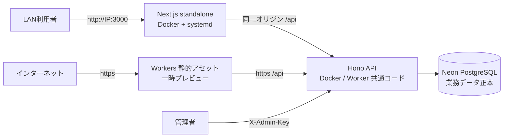
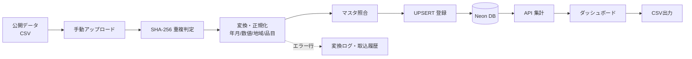

# 🏗️ Civil Cost Index Dashboard

> 建設資材価格・労務単価・物価指数を時系列で可視化するダッシュボード（FastAPI設計由来の仕様を Cloudflare Workers + Neon で実装）


## 📋 概要

公開されている建設資材価格、労務単価、物価指数を収集・整形・蓄積し、
**時系列グラフ・比較分析・CSV出力**として利用できるシステムです。

積算担当者・工事部門・営業・管理部門が、以下の業務で利用します。

- 概算工事費の検討（単価・指数の根拠整理）
- 建設資材・労務費の市況把握
- 過年度比較・地域差比較
- 社内説明資料・発注者向け資料の作成

## 🌐 稼働 URL（2026-08-01 現在）

### 🖥️ 本機（LAN）運用【本番・利用者指示】

| 対象 | URL | 備考 |
| --- | --- | --- |
| Web UI | <http://192.168.0.185:3000> | 自動割当IP + ポート3000 |
| API（直接） | <http://192.168.0.185:18000> | ポート8000は他サービス使用中のため18000 |
| API（Web経由） | `http://192.168.0.185:3000/api/*` | 同一オリジンプロキシ（CORS不要） |

systemd ユニット `cci.service` を登録済み（起動時自動起動）。Docker Compose で api/web を常駐させています。

> **WebUI**: ルート直下の `Civil Cost Index Dashboard (standalone).html` を100%適用し、
> `/` でリダイレクトなしに直接表示します（デザイン・操作・レスポンシブは正本 HTML と同一）。
> `/timeseries`・`/compare`・`/table`・`/admin/*` 等の API 連携画面も併設しています。

### ☁️ Cloudflare Workers（一時プレビュー）

| 対象 | URL | 備考 |
| --- | --- | --- |
| Web（フロントエンド） | <https://cci-web-assets.kensan1969.workers.dev> | Cloudflare Workers 静的アセット |
| API（バックエンド） | <https://cci-api-production.kensan1969.workers.dev> | Cloudflare Worker（Hono + Neon） |
| API ヘルスチェック | <https://cci-api-production.kensan1969.workers.dev/api/health/ready> | DB接続含む死活確認 |
| DB（正本） | Neon PostgreSQL（ap-southeast-1） | 接続情報は Cloudflare Secret で管理 |

> **カスタムドメイン候補（未設定・DNS変更なし・サブドメインは後日決定）**:
> `cci.mirai-dx-platform.com` / `civil-cost-index.mirai-dx-platform.com` / `costindex.mirai-dx-platform.com`
> 採用サブドメインが決まり次第、Cloudflare DNS（CNAME → `cci-web-assets.kensan1969.workers.dev` 等）を設定します。

## ✨ 主な機能

| 機能 | 説明 | 画面 |
| --- | --- | --- |
| 📊 トップダッシュボード | KPI・注目変動・データ更新状況（standalone デザイン100%適用） | `/` → `/standalone.html` |
| 📈 時系列分析 | 品目・地域・期間指定のトレンド | `/timeseries/` |
| 🔄 比較分析 | 複数系列の比較・基準年月100指数化 | `/compare/` |
| 📋 データテーブル | ソート・ページング・状態表示 | `/table/` |
| 📤 レポート出力 | CSV出力（PDFは準備中） | `/export/` |
| 🗂️ データソース管理 | 取得元の登録・無効化（管理API） | `/admin/data-sources/` |
| 📥 取込履歴 | CSV取込・成功/失敗/エラー行の確認 | `/admin/fetch-jobs/` |
| ⚙️ ユーザー設定 | 初期地域・Admin Keyの保存 | `/settings/` |

## 🏛️ アーキテクチャ

### 構成図



### データフロー



## 🧱 技術スタック

| レイヤー | 技術 | 用途 |
| --- | --- | --- |
| フロントエンド | Next.js 15 / React 19 / TypeScript | 画面・状態管理（静的エクスポート） |
| UI | Tailwind CSS | スタイリング |
| グラフ | Apache ECharts | 時系列・比較グラフ |
| バックエンド | Hono (TypeScript) on Cloudflare Workers | API・集計・CSV取込・変換 |
| DB | Neon PostgreSQL 17（本番正本） | マスタ・時系列・履歴 |
| マイグレーション | SQL（`apps/api/migrations/`） | スキーマ管理 |
| CI/CD | GitHub Actions + Wrangler | テスト・ビルド・デプロイ |
| 監視 | Workers Observability + ヘルスエンドポイント | ログ・死活確認 |

## 📁 ディレクトリ構成

```text
Civil-Cost-Index-Dashboard/
├── apps/
│   ├── web/                 # Next.js フロントエンド（static export）
│   └── api/                 # Hono Worker API + マイグレーション + シード
├── data/
│   └── samples/             # サンプルCSV（シード元）
├── docs/                    # 運用・監視・障害対応・バックアップ・リリースノート
├── infra/
│   └── neon/                # Neonプロジェクト情報（秘密情報なし）
├── .github/workflows/       # CI / デプロイ
├── docker-compose.yml       # ローカル開発用（代替手段）
└── .env.example
```

## 🚀 ローカル開発

前提: Node.js 20+ / pnpm または npm / Wrangler の Cloudflare 認証。

```bash
# 1. 環境変数
cp .env.example .env
# apps/api/.dev.vars に DATABASE_URL / ADMIN_API_KEY を設定（gitignore対象）

# 2. API（Hono Worker）
cd apps/api
npm install
npm run db:migrate   # Neonへスキーマ適用（DATABASE_URL_DIRECT使用）
npm run db:seed      # サンプルデータ投入（同一ハッシュはスキップ）
npm run dev          # http://localhost:8787

# 3. Web（別ターミナル）
cd apps/web
npm install
NEXT_STATIC_EXPORT=0 npm run dev   # http://localhost:3000
```

または Docker Compose（開発用代替）:

```bash
cp .env.example .env
docker compose up
```

## 🧪 テスト・検証

```bash
# API: 単体＋統合スモーク（統合は .dev.vars があれば実行）
cd apps/api && npm run lint && npm run typecheck && npm test && npm run test:smoke

# Web: Lint / 型 / テスト / 静的ビルド
cd apps/web && npm run lint && npm run typecheck && npm test
NEXT_STATIC_EXPORT=1 NEXT_PUBLIC_API_BASE_URL=http://localhost:8787 npm run build
```

CI（GitHub Actions）は push/PR ごとに API・Web 双方の lint / typecheck / test / build を実行します。

## 🚢 デプロイ

`main` への push で GitHub Actions が自動デプロイします（承認済みCI/CD経路）。

```bash
# 手動デプロイ（開発者）
cd apps/api && wrangler deploy          # API Worker
cd apps/web && wrangler deploy          # Web 静的アセット Worker
```

シークレット:

| シークレット | 設定先 | 用途 |
| --- | --- | --- |
| `DATABASE_URL` | Cloudflare Worker Secret | Neon接続（pooled） |
| `ADMIN_API_KEY` | Cloudflare Worker Secret | 管理API（X-Admin-Key） |
| `CLOUDFLARE_API_TOKEN` | GitHub Actions Secret | デプロイ |
| `NEXT_PUBLIC_API_BASE_URL` | GitHub Actions Variable | Webビルド時のAPI URL |

## 📚 ドキュメント

| ドキュメント | 内容 |
| --- | --- |
| [要件定義書](Civil%20Cost%20Index%20Dashboard｜要件定義書.md) | 業務要件・機能要件・MVPスコープ |
| [詳細設計仕様書](Civil%20Cost%20Index%20Dashboard｜詳細設計仕様書.md) | 画面・API・DB・ロジック詳細 |
| [API契約](docs/api-contract.md) | エンドポイント一覧・レスポンス形式 |
| [Cloudflare/Neon構成](docs/cloudflare-neon.md) | デプロイ構成・サブドメイン候補 |
| [運用手順書](docs/operations.md) | 起動・デプロイ・ログ確認・バージョンアップ |
| [監視手順書](docs/monitoring.md) | 死活監視・アラート基準・性能確認 |
| [障害対応手順書](docs/incident-response.md) | 重大度定義・ロールバック |
| [バックアップ・リストア手順書](docs/backup-restore.md) | バックアップ方針・復旧手順 |
| [リリースノート](docs/release-notes.md) | バージョン履歴・既知の制限 |

## 🔒 セキュリティ

- 管理APIは `ADMIN_API_KEY`（X-Admin-Key）で保護（本番設定済み）
- アップロードは拡張子・サイズ・SHA-256重複を検証
- CSVパース・SQLはパラメータ化（インジェクション対策）
- 静的サイトにセキュリティヘッダー適用（CSP / X-Frame-Options / nosniff 等）
- 秘密情報（DB接続文字列・APIキー）はリポジトリにコミットしない
- 本番DBへの破壊的マイグレーション・データ削除は承認なしに実行しない

## 📄 免責

本システムの表示データは参考情報であり、積算・契約・経営判断の最終根拠は
出典元の公表データと専門家の確認をもとにしてください。データ出典と基準日は画面上に明記されます。
