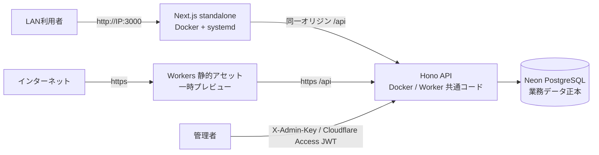
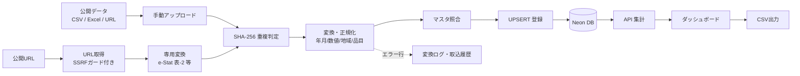

# 🏗️ Civil Cost Index Dashboard

> 建設資材価格・労務単価・物価指数を時系列で可視化するダッシュボード（FastAPI設計由来の仕様を Cloudflare Workers + Neon で実装）


## 📋 概要

公開されている建設資材価格、労務単価、物価指数を収集・整形・蓄積し、
**時系列グラフ・比較分析・CSV出力**として利用できるシステムです。

積算担当者・工事部門・営業・管理部門が、以下の業務で利用します。

- 概算工事費の検討（単価・指数の根拠整理）
- 建設資材・労務費の市況把握
- 過年度比較・地域差比較
- 社内説明資料・発注者向け資料の作成

## 🎯 システムの位置付け

本システムは**正式な積算システムではありません**。工事数量から労務・材料・機械の所要量を
展開し、直接工事費・間接工事費・一般管理費・消費税まで計算する機能は提供しません。

位置付けは「**建設コスト・市況分析基盤（積算前後の判断支援）**」です。

- 入札参加前の市況確認
- 過年度案件を基準にした概算補正の根拠整理
- 見積有効期間中の価格変動確認
- 工事部門・営業・積算部門間の根拠共有
- 発注者への価格上昇説明・経営会議用の原価リスク把握

画面の表示値はすべて参考情報であり、積算・契約・経営判断の最終根拠には出典元の公表値を
ご確認ください（本README末尾の免責も参照）。

## 🗂️ データ種別（実単価／指数／動向評価値の区別）

システムではデータを以下の種別で管理し、画面上で「積算参考可／参考のみ」を区別します。

| データ種別 | 例 | 積算利用 |
| --- | --- | --- |
| 実単価 | けんせつPlaza 主要建設資材価格、公共工事設計労務単価 | 単価候補として利用可能 |
| 公的指数 | e-Stat 消費者物価指数、建設物価指数 | 価格補正・傾向分析 |
| 動向評価値 | 主要建設資材需給・価格動向調査（1〜5段階） | 市況の参考情報のみ |
| 社内実績単価 | 購買価格、協力会社見積 | 権限管理下で積算参考 |
| 採用単価 | 積算責任者が決定した単価 | 正式な積算計算に使用 |

`ESTAT_MATERIAL_SUPPLY`（主要建設資材需給・価格動向調査）は**国土交通省**が毎月公表する
モニター調査の**動向評価値**であり、円/t・円/m³ の実価格でも公的指数でもありません。
本システムでは「参考のみ」として取扱い、実単価系列と同じグラフで比較する場合も種別バッジを表示します。

## 🌐 稼働 URL（2026-08-01 現在）

### 🖥️ 本機（LAN）運用【本番・利用者指示】

| 対象 | URL | 備考 |
| --- | --- | --- |
| Web UI | <http://192.168.0.185:3000> | 自動割当IP + ポート3000 |
| API（直接） | <http://192.168.0.185:18000> | ポート8000は他サービス使用中のため18000 |
| API（Web経由） | `http://192.168.0.185:3000/api/*` | 同一オリジンプロキシ（CORS不要） |

systemd ユニット `cci.service` を登録済み（起動時自動起動）。Docker Compose で api/web を常駐させています。

> **WebUI**: ルート `/` は React WebUI（Next.js アプリ）を直接配信します
> （AI市況サマリー・アラート・レンジバンドチャート等の改善版 UI）。
> 旧 standalone HTML は `/standalone.html` として引き続き参照できます。
> `/timeseries`・`/compare`・`/table`・`/admin/*` 等の API 連携画面も併設しています。

### ☁️ Cloudflare Workers（一時プレビュー）

| 対象 | URL | 備考 |
| --- | --- | --- |
| Web（フロントエンド） | <https://cci-web-assets.kensan1969.workers.dev> | Cloudflare Workers 静的アセット |
| Web（本番ドメイン） | <https://ccid.mirai-dx-platform.com> | 2026-08-01 設定。Cloudflare Access 適用済み（mirai-const.co.jp メール限定） |
| API（バックエンド） | <https://cci-api-production.kensan1969.workers.dev> | Cloudflare Worker（Hono + Neon） |
| API ヘルスチェック | <https://cci-api-production.kensan1969.workers.dev/api/health/ready> | DB接続含む死活確認 |
| DB（正本） | Neon PostgreSQL（ap-southeast-1） | 接続情報は Cloudflare Secret で管理 |

> **カスタムドメイン**: `ccid.mirai-dx-platform.com`（2026-08-01 決定・設定済み）。
> DNS（AAAA 100::）と Workers カスタムドメイン（cci-web-assets）を GitHub Actions の
> `Deploy Cloudflare (manual)` で冪等に管理します。アクセス制限（Cloudflare Access）は
> 適用・動作確認済み（ポリシーID `5a9f0252-85a4-490e-8814-5752bb4559f8`、mirai-const.co.jp メール限定）。
> 未認証アクセスは Cloudflare Access のログインへリダイレクトされます。

## ✨ 主な機能

| 機能 | 説明 | 画面 |
| --- | --- | --- |
| 📊 トップダッシュボード | KPI・注目変動・データ更新状況・AI市況サマリー（React WebUI） | `/` |
| 📈 時系列分析 | 品目・地域・期間指定のトレンド | `/timeseries/` |
| 🔄 比較分析 | 複数系列の比較・基準年月100指数化 | `/compare/` |
| 📋 データテーブル | ソート・ページング・状態表示 | `/table/` |
| 📤 レポート出力 | CSV／Excel／PDF／PowerPoint出力＋積算連携Excel（単価候補・根拠・改定差分） | `/export/` |
| ▥ 案件影響分析 | 案件・数量・基準単価・調達月を登録し、価格影響額（数量×基準単価×変動率）を下振れ/標準/上振れ・月別に試算 | `/projects/` |
| ⚓ 港湾コストモデル | 作業船損料・稼働率・回航費・待機費の簡易試算（浚渫／ケーソン／基礎捨石のPoC） | `/port/` |
| 🗂️ データソース管理 | 公式データソース登録・URL取得（CSV/Excel）・無効化 | `/admin/data-sources/` |
| 📥 取込履歴 | CSV/Excel/URL取込の成功・失敗・エラー行確認 | `/admin/fetch-jobs/` |
| ⏰ 定期取得 | Cloudflare Cronによる日次/月次/年次取得・未更新通知（Teams/Slack）・承認後に本番反映 | `/admin/schedules/` |
| ✓ 承認待ちデータ | 定期取得データの承認・却下（データ承認者／積算責任者） | `/admin/staged/` |
| ¥ 単価版管理 | 適用開始日・税込/税抜・運賃込み/別・旧版比較・承認・スナップショット | `/admin/price-versions/` |
| ⚙️ ユーザー設定 | 初期地域・Admin Keyの保存 | `/settings/` |
| ☺ ユーザー管理 | RBAC（7役割）とCloudflare Accessメール連携 | `/admin/users/` |
| ✎ 操作監査 | 個人単位の操作監査ログ（監査者／管理者） | `/admin/audit/` |
| ✦ AI市況ナビ | AI市況サマリー（対象者別）・アラート説明・レポート生成・分析テンプレート | `/ai/` |
| ◈ AI管理 | データ品質チェック（更新遅延・外れ値・表記揺れ）・品質スコア・AI利用監査ログ | `/admin/ai/` |

## 🤖 AI機能（AI拡張 Phase 1）

「可視化ダッシュボード」から「建設コスト・インテリジェンス基盤」への第一歩として、以下のAI機能を搭載しています。

- **AI市況サマリー** — 最新月の主要変動・前月比/前年比・連続上昇/下落を日本語で自動要約。経営層／積算担当／発注者向けの文体切替に対応
- **AIアラート説明** — 閾値判定（ルールで確定）に「4か月連続上昇」などの文脈を添えた説明を自動付加
- **AIレポート生成** — データ表・出典・免責付きのMarkdownレポート（月次市況／経営会議向け／積算向け／発注者向け）
- **AIデータ品質支援** — 更新遅延・欠損月・固定値・統計的外れ値（Zスコア）・品目名表記揺れの「確認候補」提示と品質スコア
- **AI利用監査** — 質問・モデル・回答・出典・トークン・利用者評価を `ai_audit_logs` に保存

設計原則: **集計・計算・アラート判定はコード、AIは説明のみ**。回答には必ず出典・基準年月・生成方式を付け、AI未設定環境でもルール生成テキストで全機能が動作します。

| 環境変数 / バインディング | 内容 |
| --- | --- |
| `ANTHROPIC_API_KEY`（Secret） | 設定時は Anthropic API（claude-opus-5）を使用 |
| `DEEPSEEK_API_KEY`（Secret） | DeepSeek API（deepseek-chat・OpenAI互換）。コスト重視タスクの既定推奨 |
| `PERPLEXITY_API_KEY`（Secret） | Perplexity API（sonar・最新情報調査向け） |
| Workers AI バインディング `AI` | APIキー不要のフォールバック（@cf/meta/llama-3.3-70b-instruct-fp8-fast） |
| `AI_MODEL` / `AI_PROVIDER` | モデル・プロバイダーの上書き（`anthropic` / `deepseek` / `perplexity` / `workers-ai` / `none`） |

プロバイダー優先順位（未指定時）: Anthropic → DeepSeek → Perplexity → Workers AI → ルール生成。
`/api/ai/status` で設定状況と選択中プロバイダーを確認できます。

Phase 2〜4（データ品質拡張・自然言語検索/RAG・予測/案件影響）のロードマップは [AI拡張ロードマップ](docs/ai-roadmap.md) を参照してください。

## 🗄️ データソース

| コード | データソース | 種別 | 提供元 | 形式 | 更新頻度 | 取得方法 |
| --- | --- | --- | --- | --- | --- | --- |
| `ESTAT_MATERIAL_SUPPLY` | e-Stat 主要建設資材需給・価格動向調査 | 資材 | 国土交通省 | Excel | 月次 | URL取込（専用変換。動向評価値として「参考のみ」） |
| `ESTAT_CPI` | e-Stat 消費者物価指数 | 指数 | 総務省統計局 | API | 月次 | e-Stat API（appId必須） |
| `KENPLAZA_MATERIAL` | けんせつPlaza 主要建設資材価格 | 資材 | 経済調査会 | Web | 月次 | Web閲覧・手動取込 |
| `MLIT_LABOR` | 公共工事設計労務単価 | 労務 | 国土交通省 | PDF/Excel | 年次 | 公表資料の手動取込 |

取得手順・API仕様・マッピングは [データ取得手順書](docs/data-acquisition.md) を参照してください。

## 🏛️ アーキテクチャ

### 構成図



### データフロー



## 🧱 技術スタック

| レイヤー | 技術 | 用途 |
| --- | --- | --- |
| フロントエンド | Next.js 15 / React 19 / TypeScript | 画面・状態管理（静的エクスポート） |
| UI | Tailwind CSS | スタイリング |
| グラフ | Apache ECharts | 時系列・比較グラフ |
| バックエンド | Hono (TypeScript) on Cloudflare Workers | API・集計・CSV/Excel/URL取込・専用変換 |
| DB | Neon PostgreSQL 17（本番正本） | マスタ・時系列・履歴 |
| マイグレーション | SQL（`apps/api/migrations/`） | スキーマ管理 |
| CI/CD | GitHub Actions + Wrangler | テスト・ビルド・デプロイ |
| 監視 | Workers Observability + ヘルスエンドポイント | ログ・死活確認 |

## 📁 ディレクトリ構成

```text
Civil-Cost-Index-Dashboard/
├── apps/
│   ├── web/                 # Next.js フロントエンド（static export）
│   └── api/                 # Hono Worker API + マイグレーション + シード
├── data/
│   └── samples/             # サンプルCSV（シード元）
├── docs/                    # 運用・監視・障害対応・バックアップ・リリースノート
├── infra/
│   └── neon/                # Neonプロジェクト情報（秘密情報なし）
├── .github/workflows/       # CI / デプロイ
├── docker-compose.yml       # ローカル開発用（代替手段）
└── .env.example
```

## 🚀 ローカル開発

前提: Node.js 20+ / pnpm または npm / Wrangler の Cloudflare 認証。

```bash
# 1. 環境変数
cp .env.example .env
# apps/api/.dev.vars に DATABASE_URL / ADMIN_API_KEY を設定（gitignore対象）

# 2. API（Hono Worker）
cd apps/api
npm install
npm run db:migrate   # Neonへスキーマ適用（DATABASE_URL_DIRECT使用）
npm run db:seed      # サンプルデータ投入（同一ハッシュはスキップ）
npm run dev          # http://localhost:8787

# 3. Web（別ターミナル）
cd apps/web
npm install
NEXT_STATIC_EXPORT=0 npm run dev   # http://localhost:3000
```

または Docker Compose（開発用代替）:

```bash
cp .env.example .env
docker compose up
```

## 🧪 テスト・検証

```bash
# API: 単体＋統合スモーク（統合は .dev.vars があれば実行）
cd apps/api && npm run lint && npm run typecheck && npm test && npm run test:smoke

# Web: Lint / 型 / テスト / 静的ビルド
cd apps/web && npm run lint && npm run typecheck && npm test
NEXT_STATIC_EXPORT=1 NEXT_PUBLIC_API_BASE_URL=http://localhost:8787 npm run build
```

CI（GitHub Actions）は push/PR ごとに API・Web 双方の lint / typecheck / test / build を実行します。

## 🚢 デプロイ

`main` への push で GitHub Actions が自動デプロイします（承認済みCI/CD経路）。

```bash
# 手動デプロイ（開発者）
cd apps/api && wrangler deploy          # API Worker
cd apps/web && wrangler deploy          # Web 静的アセット Worker
```

シークレット:

| シークレット | 設定先 | 用途 |
| --- | --- | --- |
| `DATABASE_URL` | Cloudflare Worker Secret | Neon接続（pooled） |
| `ADMIN_API_KEY` | Cloudflare Worker Secret | 管理API（X-Admin-Key） |
| `CF_ACCESS_TEAM_DOMAIN` / `CF_ACCESS_AUD` | Cloudflare Worker Secret | RBAC（Cloudflare Access JWT検証） |
| `NOTIFY_TEAMS_URL` / `NOTIFY_SLACK_URL` | Cloudflare Worker Secret | 定期取得・未更新通知 |
| `CLOUDFLARE_API_TOKEN` | GitHub Actions Secret | デプロイ |
| `NEXT_PUBLIC_API_BASE_URL` | GitHub Actions Variable | Webビルド時のAPI URL |

## 📚 ドキュメント

| ドキュメント | 内容 |
| --- | --- |
| [要件定義書](Civil%20Cost%20Index%20Dashboard｜要件定義書.md) | 業務要件・機能要件・MVPスコープ |
| [詳細設計仕様書](Civil%20Cost%20Index%20Dashboard｜詳細設計仕様書.md) | 画面・API・DB・ロジック詳細 |
| [API契約](docs/api-contract.md) | エンドポイント一覧・レスポンス形式 |
| [Cloudflare/Neon構成](docs/cloudflare-neon.md) | デプロイ構成・サブドメイン候補 |
| [運用手順書](docs/operations.md) | 起動・デプロイ・ログ確認・バージョンアップ |
| [監視手順書](docs/monitoring.md) | 死活監視・アラート基準・性能確認 |
| [障害対応手順書](docs/incident-response.md) | 重大度定義・ロールバック |
| [バックアップ・リストア手順書](docs/backup-restore.md) | バックアップ方針・復旧手順 |
| [リリースノート](docs/release-notes.md) | バージョン履歴・既知の制限 |
| [外部評価の検証結果と対応方針（2026-08-04）](docs/evaluation-response-2026-08-04.md) | 評価の裏取り・実施済み対応・今後のロードマップ |
| [正式な土木建設専用積算システム拡張仕様書](docs/estimating-system-spec.md) | 積算エンジン・歩掛・諸経費・港湾対応・AI候補生成の全体仕様（構想） |

## 🔒 セキュリティ

- 管理APIは `ADMIN_API_KEY`（X-Admin-Key）に加え、RBAC（7役割）と Cloudflare Access JWT で保護
- 変更操作（単価版・定期取込・案件・ユーザー管理）は個人単位の操作監査ログに記録
- 定期取得データは承認後に本番反映（データ承認者／積算責任者）
- アップロードは拡張子・サイズ・SHA-256重複を検証
- CSVパース・SQLはパラメータ化（インジェクション対策）
- 静的サイトにセキュリティヘッダー適用（CSP / X-Frame-Options / nosniff 等）
- 秘密情報（DB接続文字列・APIキー）はリポジトリにコミットしない
- 本番DBへの破壊的マイグレーション・データ削除は承認なしに実行しない

## 📄 免責

本システムの表示データは参考情報であり、積算・契約・経営判断の最終根拠は
出典元の公表データと専門家の確認をもとにしてください。データ出典と基準日は画面上に明記されます。
