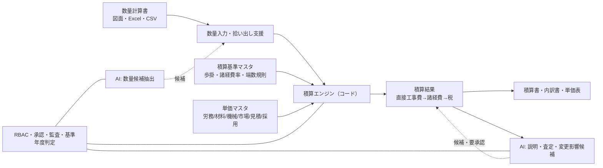

# 正式な土木建設専用積算システム（AI積極活用）拡張仕様書

更新日: 2026-08-05
ステータス: 構想・仕様案（Phase 4 の土台は実装済み: 2026-08-05）

## 1. 目的と位置付け

本システムは現在「建設コスト・市況分析基盤（積算判断支援）」として運用している。
本章の仕様追加により、以下の3層構成へ発展させる。

| 層 | 役割 | 現状 |
| --- | --- | --- |
| 市況・データ層 | 価格・指数・動向の収集・品質管理・単価版・スナップショット | ✅ 実装済み |
| 積算支援層 | 案件影響分析・積算連携Excel・港湾PoC・RBAC/監査 | ✅ 実装済み（港湾はPoC） |
| 積算中核層（新設） | 数量×歩掛×単価による正式な工事費計算・積算書出力 | ⛔ 未実装（本書の対象） |

目標位置付け:

> **一般土木＋港湾（マリコン）の正式な積算計算ができる「土木建設専用積算システム」。**
> 計算・端数処理・税計算はすべてコードで確定し、AIは数量拾い出し・歩掛選定・査定・
> 説明文・変更影響などの**候補生成と判断支援**を積極的に担当する。ただしAIが金額を確定しない。

### 1.1 確定した方針（2026-08-05 利用者回答）

| 項目 | 決定内容 |
| --- | --- |
| 積算基準データの入手 | **3経路を選択式で対応**（国交省公表資料の電子化／書籍から整備／既存積算システムからエクスポート） |
| 既存積算システムとの関係 | **当面併用**（Excel/API連携を主軸に、段階的に置き換え判断） |
| AIプロバイダー | Anthropic / **Perplexity** / **DeepSeek** / Workers AI に対応。コスト重視タスクはDeepSeekを既定推奨 |
| AI送信許可 | 3社（Anthropic・Perplexity・DeepSeek）へのデータ送信は許可済み。案件名・未公開価格を含むプロンプトは送信可否を設定で制御 |
| 港湾の優先工種 | 浚渫・ケーソン・基礎捨石の3工種から開始 |
| 数量拾い出し | まず「数量計算書Excelの取込・AIチェック」を先行し、図面OCRは候補提示まで（データ整備方針は §5.1） |

## 2. 全体アーキテクチャ

設計原則（既存の「計算と判定はコード、AIは説明」を維持しつつAIの担当範囲を拡大）:

1. **確定計算はコード**: 数量×歩掛×単価、端数処理、諸経費、消費税は再現可能なコードで実行
2. **AIは候補生成と判断支援**: 拾い出し・歩掛選定・査定・変更影響・説明文はAIが候補を提示し、積算担当→積算責任者の承認を必須とする
3. **根拠の追跡**: 計算行ごとに「歩掛ID・単価版ID・出典・基準年月・適用基準年度」を保持
4. **基準年度の厳格管理**: 積算時点の適用基準・単価を固定（既存スナップショットを拡張）

## 3. 機能要件（新規追加）

### F1 積算基準管理
- 積算基準マスタ（土木工事標準積算基準 / 港湾請負工事積算基準 / 適用年度・適用開始日）
- 端数処理規則（円未満切捨て等、基準ごと・費目ごと）
- 諸経費率（共通仮設費率・現場管理費率・一般管理費等率）と補正係数（地域・工種・規模別）
- 基準の新旧差分管理（次年度基準への切替時に旧基準での再計算を可能に）

### F1-2 積算基準データの取込（3経路・選択式）

| 経路 | 入力 | 特徴 | 整備手順 |
| --- | --- | --- | --- |
| A. 国交省公表資料の電子化 | PDF/Excel（歩掛表・諸経費率・労務単価） | 公式データ。表構造の変換が必要 | 公表資料を取込→AIが表構造を候補化→人が確認→承認→マスタ登録 |
| B. 書籍から整備 | 標準Excelテンプレート | 書籍の歩掛表を手入力/一括貼付 | 定形テンプレート（工種・条件・労務/材料/機械の列定義）で入力→検証→承認 |
| C. 既存積算システムからエクスポート | CSV/Excel（またはAPI） | 自社の現行データを移行 | 品目/細別コード対応付け→取込→現行システムとの突合検証→承認 |

共通仕様:
- 取込履歴・SHA-256重複防止・エラー行記録（既存の取込基盤を再利用）
- 基準年度・適用日・出典・取得日時・ライセンス/転載可否を必ず保持
- 取込データは承認後に本番マスタへ反映（既存の承認ワークフローを再利用）
- 3経路とも同一の正規化スキーマ（工種/細別/条件/労務・材料・機械明細）へ変換

### F2 工種体系マスタ
- 一般土木: 工種→区分子→細別→規格の階層
- 港湾: 港湾工事の工種体系（浚渫・地盤改良・ケーソン・基礎捨石・被覆消波・護岸岸壁・海上運搬・潜水作業等）
- 施工条件コード（土質・断面・運搬距離・海域・作業水深・昼夜等）と歩掛選択条件

### F3 案件・数量入力
- 工事案件（発注者・工種・地域・入札/契約/施工期間・適用積算基準年度）※既存 projects を拡張
- 数量計算書（細別・規格・単位・数量・施工条件・備考・出典）
- Excel数量計算書の取込（品目/細別コード対応付け・再取込）
- 設計変更後の数量改定（変更前後を保持）

### F4 歩掛展開
- 標準歩掛マスタ: 細別×施工条件 → 労務・材料・機械の所要量明細
- 施工パッケージ型積算（基準の施工パッケージ単位での一括展開）
- 補正係数（土質・断面・機械能力・水深・運搬距離・稼働率など）
- 機械損料・作業船損料（供用係数・拘束費・回航/えい航費・潜水士班）
- 歩掛バージョン管理（基準年度ごと）とAIによる選定候補提示

### F5 単価・代価表
- 労務単価（公共工事設計労務単価）、材料単価、機械損料、市場単価、協力会社見積、社内実績
- 既存の単価版管理・スナップショットを「代価表」として統合
- 採用単価（積算責任者承認）と積算時点固定
- 運賃・諸経費・税の分離（税込/税抜・運賃込み/別）

### F6 積算計算エンジン
- 直接工事費 = Σ（数量 × 歩掛明細 × 単価）
- 共通仮設費 → 現場管理費 → 一般管理費等 → 消費税（率方式＋補正、基準ごとの規則）
- 端数処理（基準ごと・費目ごと）
- 再計算の完全再現性（同一入力→同一出力）

### F7 積算書・内訳書・単価表出力
- Excel（セルごとに単価・歩掛・出典・基準年月を付与）／PDF／CSV
- 積算書（工事費総括表）、内訳書、単価表、施工パッケージ明細
- 積算連携API（既存 `/api/export/estimate-link` を拡張）

### F8 見積比較・査定支援
- 協力会社見積の取込・正規化（同一条件・運賃/諸経費/税の分離）
- 過去実績・公表価格・最新見積・採用単価の比較表
- 異常値・前回比警告、有効期限アラート
- 採用理由の記録（監査可能）

### F9 設計変更・変更契約差額
- 変更前後数量・単価・積算基準年度の保持
- 変更契約差額の自動計算（増額/減額明細）
- AIによる影響範囲・根拠条文の候補抽出

### F10 港湾（マリコン）対応
- 既存PoC（作業船・工種3種）を正式化
- 船舶/機械損料・供用係数・回航/えい航費・拘束費・潜水士/送気員労務
- 港湾別・海域別条件（潮位・波浪・風速・濁り・航路規制）
- 土質・浚渫土量・土運船運搬距離・揚土/土捨場/処分費
- 海上施工可能日数・稼働率（気象海象による算定）
- 夜間施工・交代制・超勤補正
- 港湾工事特有の共通仮設費・現場管理費
- 適用港湾積算基準の年度管理

### F11 AI支援機能（候補生成・要承認）

AIは金額を確定せず、以下の「候補」を生成し、承認後だけ計算エンジンへ渡す。

| AI機能 | 出力 | 承認者 |
| --- | --- | --- |
| 数量拾い出し候補（図面/数量計算書OCR・マルチモーダル） | 細別・数量の候補リスト | 積算担当 |
| 歩掛・施工パッケージ選定候補 | 適用候補と根拠（条件一致度） | 積算担当 |
| 単価候補提示（市況・実績・見積から） | 単価帯・推奨候補 | 積算責任者（採用単価） |
| 見積査定コメント | 異常値・比較コメント | 積算担当/責任者 |
| 設計変更影響の候補一覧 | 影響明細・根拠条文 | 積算責任者 |
| 発注者説明文案 | 文章 | 積算責任者/営業 |
| 予測シナリオ（現状維持/上昇/急騰/下落） | 参考レンジ・信頼区間・データ充足度 | 参考（計算はコード） |
| 自然言語検索/RAG（基準・歩掛・過去案件） | 根拠付き回答 | 閲覧 |

AI候補は `ai_suggestions` テーブルに保存し、生成根拠・モデル・プロンプト版・承認状態を監査する。

### F11-2 AIプロバイダー構成

| プロバイダー | 用途想定 | 備考 |
| --- | --- | --- |
| Anthropic | 高精度な文書生成・複雑な根拠付き回答 | 既存の `ANTHROPIC_API_KEY` |
| Perplexity | 最新情報を伴う調査・出典付き回答 | `PERPLEXITY_API_KEY`（新規） |
| DeepSeek | 大量処理・コスト重視タスク（既定推奨） | `DEEPSEEK_API_KEY`（新規・OpenAI互換API） |
| Workers AI | APIキー不要のフォールバック | 既存 |

ルーティング方針:
- タスク種別ごとにプロバイダーを指定（要約/査定/拾い出し/検索など）
- 既定は「安価で十分な品質」のDeepSeek、高精度が必要な文書はAnthropic
- 送信制御: 案件名・未公開価格・協力会社見積を含むプロンプトは、設定で
  「マスキングして送信」「送信禁止（ローカル/ルール生成へフォールバック）」を選択可能

## 4. データモデル追加案（テーブル）

| テーブル | 内容 |
| --- | --- |
| `estimation_bases` | 積算基準・適用年度・適用開始日・端数処理JSON・諸経費率JSON |
| `work_type_trees` | 工種/区分子/細別/規格の階層（一般土木・港湾） |
| `quantities` | 案件別数量計算書（細別・規格・単位・数量・施工条件・出典） |
| `work_breakdowns` | 歩掛（細別×条件→労務/材料/機械明細、基準年度付き） |
| `construction_packages` | 施工パッケージ定義と構成 |
| `overhead_rates` | 共通仮設費/現場管理費/一般管理費等率・補正係数 |
| `estimate_headers` / `estimate_lines` / `estimate_materials` | 積算結果（総括表・内訳・代価明細） |
| `quotations` | 協力会社見積・正規化条件・採用理由 |
| `change_orders` | 設計変更・変更契約差額 |
| `sea_conditions` / `workability_days` | 港湾の海象条件・海上施工可能日数 |
| `soil_types` / `spoil_grounds` | 土質・土捨場・処分費 |
| `ai_suggestions` | AI候補（種別・根拠・モデル・承認状態） |
| `port_*` 拡張 | 既存 vessels / port_work_types を正式係数対応に拡張 |

既存の `projects` / `price_versions` / `price_snapshots` / `time_series_values` /
`operation_audit_logs` / `ai_audit_logs` は積算中核層から参照する。

## 5. AI活用の運用ルール

- **確定禁止事項**: AIが直接工事費・諸経費・税・積算書の金額を出力しない
- **候補→承認フロー**: AI候補は必ず積算担当の確認、採用単価・積算書は積算責任者の承認
- **外部送信制御**: 案件名・未公開価格・協力会社見積を外部AIへ送る場合はマスキングまたは社内モデル利用。
  設定で「未公開情報を含むAI利用」を禁止できる
- **監査**: `ai_suggestions` + `ai_audit_logs` に質問・モデル・プロンプト版・根拠・採用/却下・操作者を保存
- **基準データの著作権**: 歩掛・諸経費率は国交省公表資料・書籍・既存システムから整備する際に
  利用条件（二次利用・社内利用）を確認し、台帳化する

### 5.1 数量拾い出しのデータ整備方針（図面OCRサンプル案）

図面OCRは**候補提示まで**を目標とし、以下の順でデータを整備する。

1. **数量計算書Excelの取込を最優先**
   - 自社の過去案件の数量計算書（Excel）をテンプレート化し、AIが「細別・数量・施工条件」を候補化
   - 図面OCRより実務効果が高く、正解データ（承認済み数量）が手元にあるため評価もしやすい
2. **図面OCR用サンプルの入手・作成**
   - 自社の過去案件図面（施工図・設計図。社内利用・機密管理）
   - 国交省・地方整備局・自治体が公表する入札/発注図面・数量計算書（公共工事の発注情報ページ）
   - 教科書・参考書の例題図面（著作権・転載条件を確認）
   - **合成サンプルの生成**: CAD/図面PDFを自前で作成（寸法・数量が既知=正解ラベル付き）。
     寸法・数量を変えて数十件生成すれば、AI拾い出し精度の評価データになる
3. **PoC評価方法**
   - 正解ラベル（数量）付きサンプルで「細別の一致率・数量の誤差率」を評価
   - 精度基準（例: 細別一致率90%以上・数量誤差±5%以内）を満たすまで「候補」として運用
   - 最終数量は必ず積算担当の確認・承認

## 6. ロードマップ（Phase 4〜6）

| Phase | 内容 | 受入基準 |
| --- | --- | --- |
| 4 | 基本積算エンジン（一般土木） | ✅ 土台実装済み（基準/工種/数量/歩掛/諸経費/計算/積算書Excel/AI歩掛候補）。次は歩掛データの本格投入と照合検証 |
| 5 | マリコン（港湾）正式化 | ✅ 土台＋海象条件＋浚渫条件＋夜間/交代制/超勤補正＋設計変更・変更契約差額＋積算書PDF＋見積比較・査定支援を実装。正式な令和8年度係数データは3経路の取込で投入 |
| 6 | AI積極活用 | 数量拾い出し候補・歩掛選定候補・査定支援・変更影響候補・RAG・予測シナリオを実装し、承認フローで運用 |

各Phaseで「積算基準データ整備」が先行する。歩掛・諸経費率の電子データは
国交省公表資料・書籍・既存積算システムのエクスポートから整備する。

## 7. 評価項目との対応

| 評価項目 | 現状 | 本書の追加で目指す水準 |
| --- | --- | --- |
| 市況把握・価格変動監視 | 85/100（実装済み） | 維持 |
| 概算検討支援 | 75/100（実装済み） | 90以上（積算エンジン連携） |
| 見積根拠・説明資料 | 70/100（PDF/PPTX/積算連携を実装） | 90以上（セル出典付与・積算書出力） |
| データ品質・監査 | 75/100（実装済み） | 維持＋AI候補監査 |
| マリコン固有業務 | 40/100（PoC実装） | 80以上（港湾積算基準対応） |
| 正式な工事積算 | 30/100（未実装） | 85以上（Phase 4完了時） |
| 本番運用・セキュリティ | 65/100（RBAC等を実装） | 90以上（承認・監査・基準年度管理） |

## 8. 実装に必要な決定事項（要確認）

1. **積算基準データの入手経路**: 国交省公表資料の電子化 / 書籍からの整備 / 既存積算システムからのエクスポート
2. **既存積算システムとの関係**: 連携（Phase 3のExcel/API受け渡し）から段階的に置き換えるか、併用するか
3. **AIの自動化範囲**: 数量拾い出しをどこまで自動化するか（図面OCRは「候補」に限定）
4. **AIプロバイダー**: Anthropic / Workers AI / 社内モデルの使い分けと未公開情報の送信可否
5. **港湾の優先工種**: 浚渫・ケーソン・基礎捨石の3工種から開始（評価提案どおり）
6. **端数処理・諸経費率の運用**: 基準年度更新時の承認フローと過去基準での再計算要否
